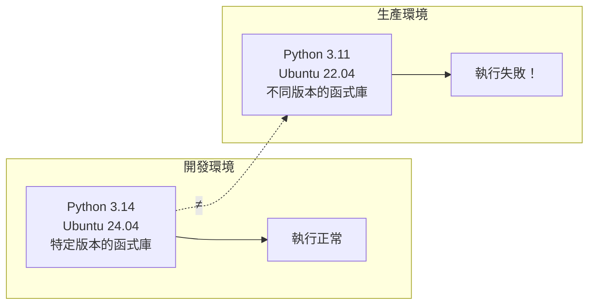
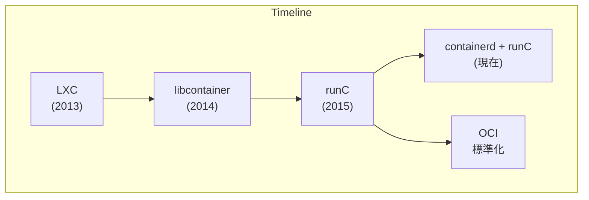

## 1.2 什麼是 Docker

Docker 是徹底改變了軟體開發和交付方式的革命性技術。本節將從核心概念、與傳統虛擬機的對比、技術基礎以及歷史生態等多個維度，帶你深入理解什麼是 Docker。

### 一句話理解 Docker

> **Docker 是一種輕量級的虛擬化技術，它讓應用程式及其依賴環境可以被打包成一個標準化的單元，在任何地方都能一致地執行。** 如果用一個生活中的類比：**Docker 之於軟體，就像集裝箱之於貨物**。

在集裝箱發明之前，貨物的運輸是一件麻煩的事情——不同的貨物需要不同的包裝、不同的裝卸方式，換一種運輸工具就要重新裝卸。集裝箱的出現改變了這一切：無論裡面裝的是什麼，集裝箱的外形是標準的，可以用同樣的方式裝卸、堆放和運輸。

Docker 做的事情類似：無論你的應用是用 Python、Java、Node.js 還是其他語言寫的，無論它需要什麼樣的依賴庫和環境，一旦被打包成 Docker 映象，就可以用同樣的方式在任何支援 Docker 的機器上執行。

### Docker 的核心價值

筆者認為，Docker 解決的是軟體開發中最古老的問題之一：**『在我機器上明明能跑啊！』**



有了 Docker：

```mermaid
flowchart LR
    subgraph Dev ["開發環境"]
        direction TB
        A["Docker 映象<br/>(包含所有依賴)"] --> B["執行正常"]
    end
    subgraph Prod ["生產環境"]
        direction TB
        C["同一個映象<br/>(完全一致)"] --> D["執行正常！"]
    end
    A === "=" === C
```

### Docker vs 虛擬機

很多人第一次接觸 Docker 時會問：**『這不就是虛擬機嗎？』** 答案是：**不是，而且差別很大。**

#### 傳統虛擬機

傳統虛擬機技術是虛擬出一套完整的硬體，在其上執行一個完整的作業系統，再在該系統上執行應用：


#### Docker 容器

而 Docker 容器內的應用直接執行於宿主的核心，容器內沒有自己的核心，也沒有進行硬體虛擬：


#### 關鍵區別

相關訊息如下表：

| 屬性 | Docker 容器 | 傳統虛擬機 |
|------|-------------|------------|
| **啟動速度** | 秒級 | 分鐘級 |
| **資源佔用** | MB 級別 | GB 級別 |
| **效能** | 接近原生 | 有明顯損耗 |
| **隔離級別** | 程序級隔離 | 完全隔離 |
| **單機數量** | 可執行上千個 | 通常幾十個 |

> 筆者經常用這個類比來解釋：虛擬機像是每個應用都住在一棟獨立的房子裡 (有自己的地基、水電系統)，而容器像是大家住在同一棟公寓樓裡的不同房間 (共享地基和水電系統，但各自獨立)。

### Docker 的技術基礎

Docker 使用 [Go 語言](https://golang.google.cn/)開發，基於 Linux 核心的以下技術：

- **[Namespace](https://en.wikipedia.org/wiki/Linux_namespaces)**：實現資源隔離 (程序、網路、檔案系統等)
- **[Cgroups](https://zh.wikipedia.org/wiki/Cgroups)**：實現資源限制 (CPU、記憶體、I/O 等)
- **[Union FS](https://en.wikipedia.org/wiki/Union_mount)**：實現分層儲存 (如 OverlayFS)

> 如果你對這些底層技術感興趣，可以閱讀本書的[底層實現](../14_implementation/README.md)章節。

#### 概述

總體概述了以下內容。

#### Docker 架構演進

Docker 的底層實現經歷了多次演進：



- **LXC** (2013)：Docker 最初基於 Linux Containers
- **libcontainer** (2014，v0.7)：Docker 自研的容器執行時
- **runC** (2015，v1.11)：捐獻給 OCI 的標準容器執行時
- **containerd**：高階容器執行時，管理容器生命週期


> `runc` 是一個 Linux 指令行工具，用於根據 [OCI 容器執行時規範](https://github.com/opencontainers/runtime-spec)建立和執行容器。

> `containerd` 是一個守護程式，它管理容器生命週期，提供了在一個節點上執行容器和管理映象的最小功能集。

### Docker 的歷史與生態

**Docker** 最初是 `dotCloud` 公司創始人 [Solomon Hykes](https://github.com/shykes) 在法國期間發起的一個公司內部專案，於 [2013 年 3 月以 Apache 2.0 授權協定開源](https://en.wikipedia.org/wiki/Docker_(software))。

Docker 的發展歷程：

- **2013 年 3 月**：開源發布
- **2013 年底**：dotCloud 公司改名為 Docker，Inc。
- **2015 年**：成立[開放容器聯盟 (OCI)](https://opencontainers.org/)，推動容器標準化
- **至今**：[GitHub 專案](https://github.com/moby/moby)超過 7 萬星標

Docker 的成功推動了整個容器生態的發展，催生了 Kubernetes、Podman 等眾多相關專案。筆者認為，Docker 最大的貢獻不僅是技術本身，更是它 **讓容器技術從系統管理員的工具變成了每個開發者都能使用的標準工具**。
