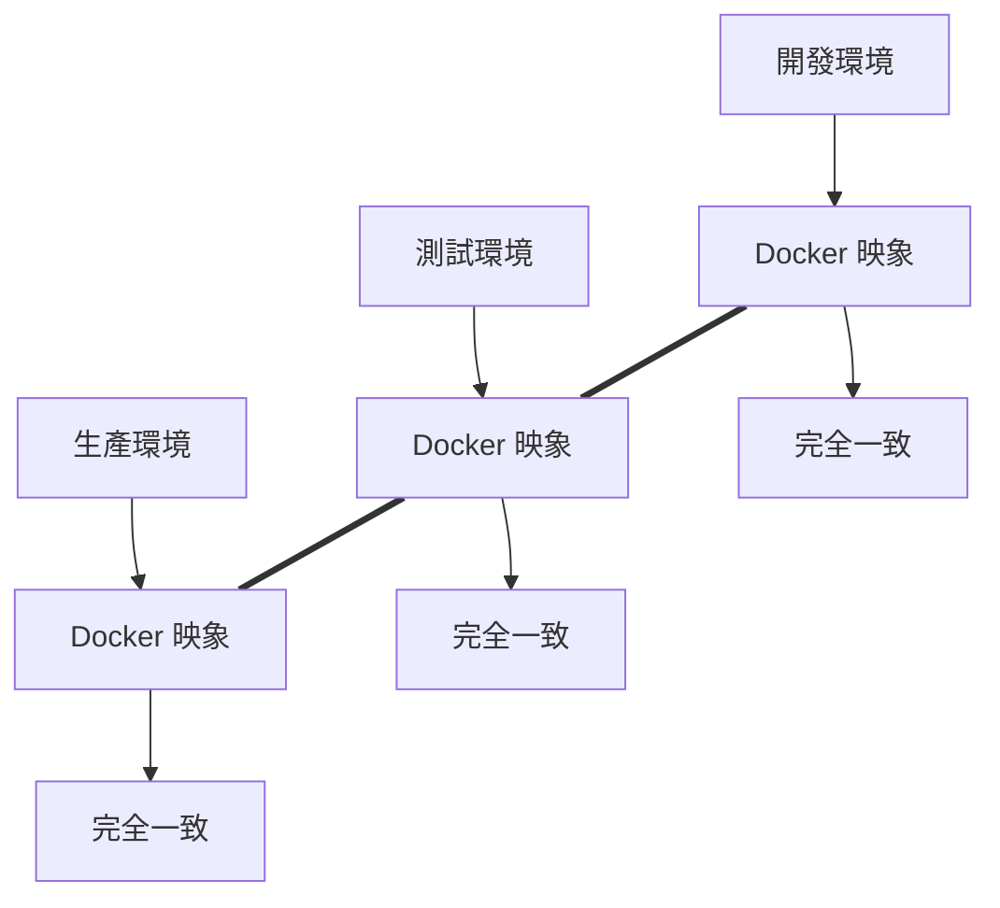
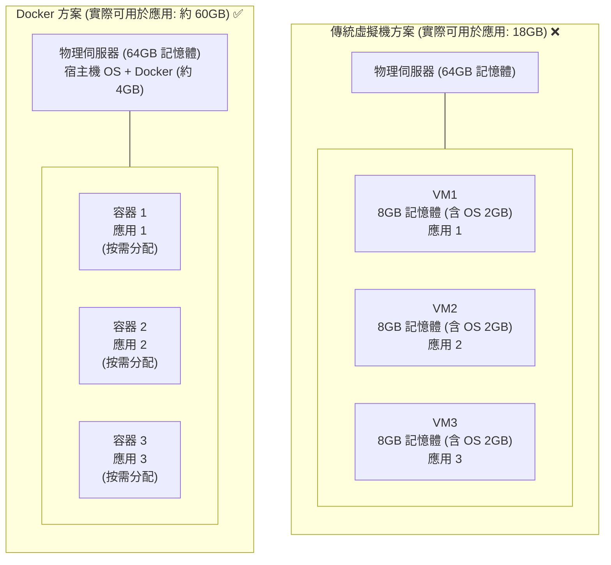
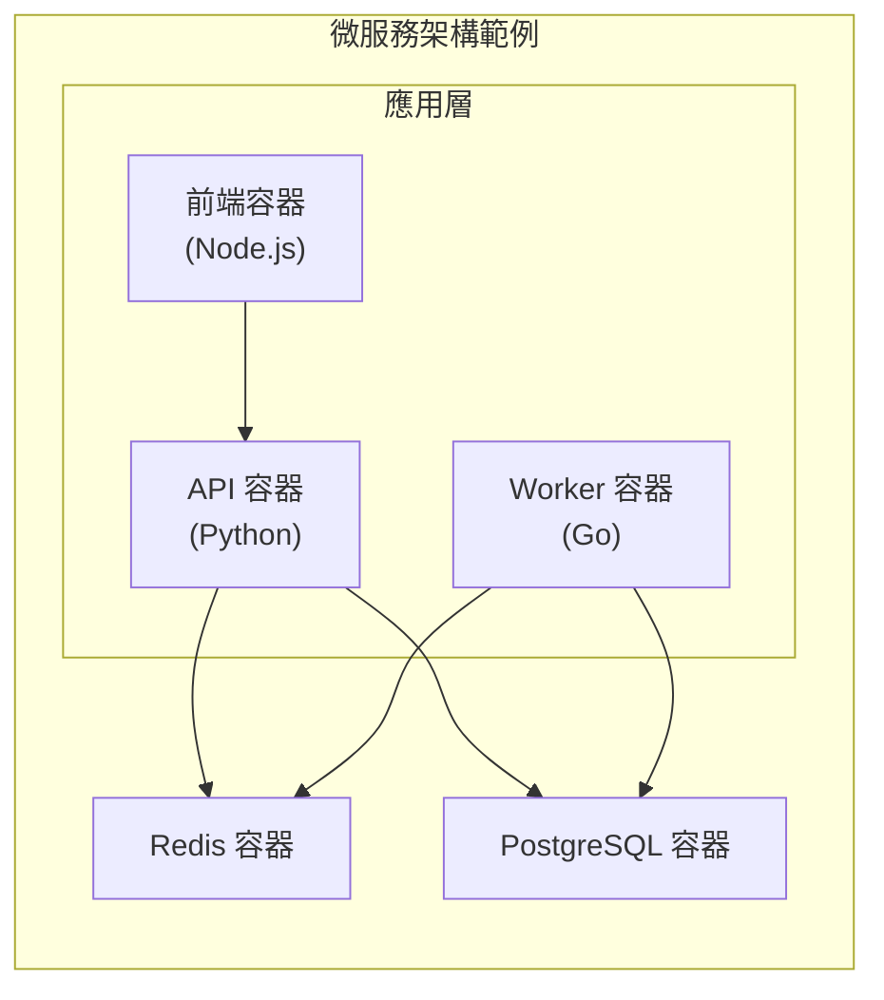

## 1.3 為什麼要使用 Docker？

在回答 『為什麼用 Docker』 之前，筆者想先問一個問題：**你有沒有經歷過這些場景？**

### 1.3.1 沒有 Docker 的世界

在 Docker 出現之前，軟體開發和運維面臨著諸多棘手的問題。我們先來看看以下三個典型的痛點場景。

#### 場景一：『在我電腦上明明能跑』

具體內容如下：

```bash
週五下午 5:00
├── 開發者：程式碼寫完了，本地測試透過，送出！🎉
├── 週一早上 9:00
│   └── 測試："這個功能在測試環境跑不起來"
└── 開發者：" 不可能，在我電腦上明明能跑啊……"
```

筆者統計過，這個問題通常由以下原因導致：

- Python/Node/Java 版本不一致
- 依賴庫版本不一致
- 作業系統設定不一致
- 某些環境變數沒有設定
- 『哦，忘了說我本地裝了個 XXX』

#### 場景二：環境設定的噩夢

具體內容如下：

```bash
新同事入職
├── Day 1：領電腦，配環境
├── Day 2：繼續配環境，遇到問題
├── Day 3：換種方法配環境
├── Day 4：問老同事怎麼配的，他也忘了
└── Day 5：終於能跑起來了！但不知道為什麼……
```

#### 場景三：伺服器遷移的恐懼

具體內容如下：

```bash
運維："我們需要把服務遷移到新服務器"
開發："舊伺服器上的設定文件在哪？"
運維："當時是一個已經離職的同事配的……"
所有人：😱
```

### 1.3.2 Docker 如何解決這些問題

Docker 的出現為上述問題提供了完美的解決方案。它透過 『一次建立，到處執行』 的核心理念，從根本上改變了軟體交付的方式。

#### 概述

總體概述了以下內容。

#### 核心理念：一次建立，到處執行

具體內容如下：



### 1.3.3 Docker 的核心優勢

除了解決上述痛點，Docker 還擁有諸多顯著的技術優勢，包括環境一致性、秒級啟動、高效的資源利用等。

#### 1. 環境一致性

Docker 映象包含了應用執行所需的 **一切**：程式碼、執行時、系統工具、函式庫、設定。這意味著：

- ✅ 開發環境和生產環境完全一致
- ✅ 不會再有 『在我機器上能跑』 的問題
- ✅ 新人入職，一條指令就能啟動開發環境

```bash
## 新同事入職第一天

$ git clone https://github.com/company/project.git
$ docker compose up
## 完整的開發環境就準備好了

...
```

#### 2. 秒級啟動

傳統虛擬機啟動需要幾分鐘 (引導作業系統)，而 Docker 容器啟動通常只需要 **幾秒甚至幾百毫秒**。

筆者實測資料：

| 啟動內容 | 虛擬機 | Docker 容器 |
|---------|--------|-------------|
| 空系統 | ~60 秒 | ~0.5 秒 |
| MySQL | ~90 秒 | ~3 秒 |
| 完整 Web 應用 | ~120 秒 | ~5 秒 |

這個差異對以下場景尤為重要：

- **CI/CD 流水線**：每次建立節省幾分鐘，一天累積下來就是幾小時
- **彈性擴容**：流量高峰時能快速啟動更多實例
- **開發體驗**：快速重啟服務進行除錯

#### 3. 資源效率

Docker 容器共享宿主機核心，無需為每個應用執行完整的作業系統。



#### 4. 持續交付和部署

Docker 完美契合 DevOps 的工作流程：


使用 [Dockerfile](../04_image/4.5_build.md) 定義映象建立過程，使得：

- 建立過程 **可重複、可追溯**
- 任何人都能從程式碼重建完全相同的映象
- 配合 [GitHub Actions](../20_cases/ci/actions/README.md) 等 CI 系統實現自動化

#### 5. 輕鬆遷移

Docker 可以在幾乎任何平台上執行：

- ✅ 本地開發機 (macOS、Windows、Linux)
- ✅ 公有雲 (AWS、Azure、GCP、阿里雲、騰訊雲)
- ✅ 私有雲和自建資料中心
- ✅ 邊緣裝置和 IoT

**同一個映象，在任何地方執行結果都一致。** 這讓應用遷移變得前所未有的簡單。

#### 6. 微服務架構的基石

現代微服務架構幾乎都依賴容器技術。Docker 讓你可以：

- **隔離服務**：每個服務執行在獨立容器中，互不干擾
- **獨立擴充套件**：哪個服務負載高，就單獨擴充套件哪個
- **獨立部署**：更新一個服務不影響其他服務
- **技術多樣**：不同服務可以用不同語言和框架



### 1.3.4 Docker 不適合的場景

筆者認為，技術選型要客觀。Docker 並非銀彈，以下場景可能不太適合：

#### 1. 需要完全隔離的場景

容器共享宿主機核心，隔離性不如虛擬機。如果你需要執行不受信任的程式碼，虛擬機可能更安全。

#### 2. 需要特殊核心的場景

容器使用宿主機核心。如果應用需要特定版本的核心或核心模組，可能需要虛擬機。

#### 3. Windows 原生應用

雖然 Docker 支援 Windows 容器，但生態不如 Linux 容器成熟。傳統 Windows 應用的容器化仍有挑戰。

#### 4. 桌面應用

Docker 主要面向伺服器端應用。桌面 GUI 應用的容器化雖然可行，但通常得不償失。

### 1.3.5 與傳統虛擬機的對比總結

相關訊息如下表：

| 屬性 | Docker 容器 | 傳統虛擬機 |
|:------|:-----------|:-----------|
| 啟動速度 | 秒級 | 分鐘級 |
| 磁碟佔用 | MB 級別 | GB 級別 |
| 效能 | 接近原生 | 有 5-20% 損耗 |
| 單機支援量 | 上千個容器 | 幾十個虛擬機 |
| 隔離性 | 程序級別 | 完全隔離 |
| 最佳場景 | 微服務、CI/CD、開發環境 | 多租戶、高安全需求 |
