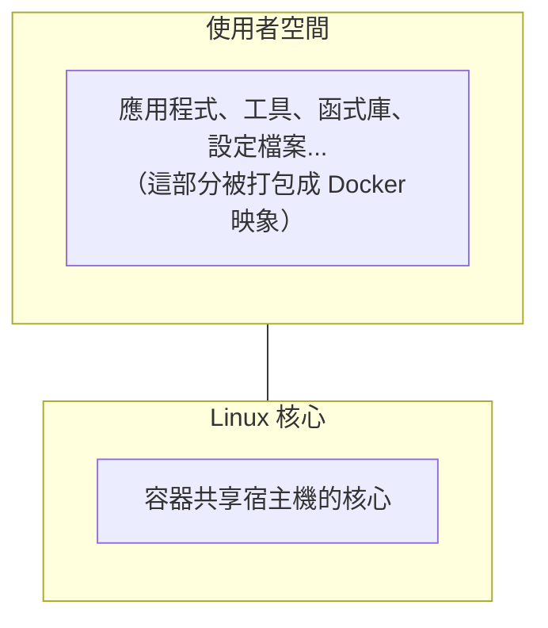
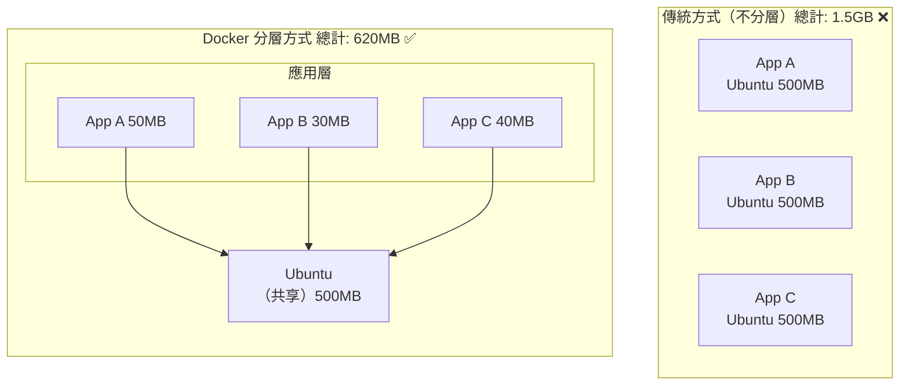
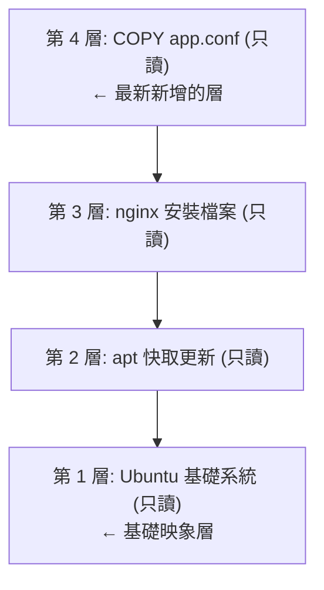

## 2.1 Docker 映象

Docker 映象作為容器執行的基石，其設計理念和實現機制至關重要。本節將深入探討映象的本質、與作業系統的關係、內容構成以及核心的分層儲存機制。

### 2.1.1 一句話理解映象

> **Docker 映象是一個只讀的樣板，包含了執行應用所需的一切：程式碼、執行時、函式庫、環境變數和設定檔案。** 如果用一個類比：**映象就像是一張光碟或 ISO 檔案**。你可以用同一張光碟在不同電腦上安裝系統，而光碟本身不會被修改。同樣，一個映象可以建立多個容器，而映象本身保持不變。

### 2.1.2 映象與作業系統的關係

我們都知道，作業系統分為 **核心** 和 **使用者空間**：



對於 Linux 而言，核心啟動後會掛載 `root` 檔案系統來提供使用者空間支援。**Docker 映象** 本質上就是一個 `root` 檔案系統。

例如，官方映象 `ubuntu:24.04` 包含了一套完整的 Ubuntu 24.04 最小系統的 root 檔案系統——但 **不包含 Linux 核心** (因為容器共享宿主機的核心)。

### 2.1.3 映象包含什麼？

Docker 映象是一個特殊的檔案系統，包含：

| 內容型別 | 範例 |
|---------|------|
| **程式檔案** | 應用二進位檔案、Python/Node 直譯器 |
| **函式庫檔案** | libc、OpenSSL、各種依賴庫 |
| **設定檔案** | nginx.conf、my.cnf 等 |
| **環境變數** | PATH、LANG 等預設值 |
| **元資料** | 啟動指令、暴露連接埠、資料卷定義 |

**關鍵屬性**：
- ✅ 映象是 **只讀** 的
- ✅ 映象 **不包含** 動態資料
- ✅ 映象建立後 **內容不會改變**

### 2.1.4 分層儲存：映象的核心設計

映象的分層儲存機制是 Docker 最具創新性的屬性之一。透過 Union FS 技術，Docker 能夠高效地建立和管理映象。

#### 為什麼需要分層？

筆者認為，分層儲存是 Docker 最巧妙的設計之一。

假設你有三個應用，都基於 Ubuntu 執行：



#### 分層是如何工作的？

筆者用一個實際的 Dockerfile 來解釋分層：

```docker
FROM ubuntu:24.04          # 第 1 層：基礎系統（約 78MB）
RUN apt-get update         # 第 2 層：更新套件索引
RUN apt-get install nginx  # 第 3 層：安裝 nginx
COPY app.conf /etc/nginx/  # 第 4 層：複製設定檔案
```

建立後的映象結構：



每一層的特點：

- **只讀**：建立完成後不可修改
- **可共享**：多個映象可以共享相同的層
- **有快取**：未變化的層不會重新建立

#### 分層儲存的 『陷阱』

> ⚠️ **筆者特別提醒**：理解這一點可以幫你避免建立出臃腫的映象。**關鍵原理**：每一層的檔案變化會被記錄，但 **刪除操作只是標記，不會真正減小映象體積**。

```docker
## 錯誤示範 ❌

FROM ubuntu:24.04
RUN apt-get update
RUN apt-get install -y build-essential  # 安裝編譯工具（約 200MB）
RUN make && make install                  # 編譯應用
RUN apt-get remove build-essential        # 試圖刪除編譯工具
## 結果：映象仍然包含 200MB 的編譯工具！

```

```docker
## 正確做法 ✅

FROM ubuntu:24.04
RUN apt-get update && \
    apt-get install -y build-essential && \
    make && make install && \
    apt-get remove -y build-essential && \
    apt-get autoremove -y && \
    rm -rf /var/lib/apt/lists/*
## 在同一層完成安裝、使用、清理

```

#### 檢視映象的分層

```bash
## 檢視映象的歷史（每層的建立記錄）

$ docker history nginx:latest

IMAGE          CREATED       CREATED BY                                      SIZE
a6bd71f48f68   2 weeks ago   CMD ["nginx" "-g" "daemon off;"]                0B
<missing>      2 weeks ago   STOPSIGNAL SIGQUIT                              0B
<missing>      2 weeks ago   EXPOSE map[80/tcp:{}]                           0B
<missing>      2 weeks ago   ENTRYPOINT ["/docker-entrypoint.sh"]            0B
<missing>      2 weeks ago   COPY 30-tune-worker-processes.sh /docker-ent…   4.62kB
...
```

### 2.1.5 映象的標識

Docker 映象有多種標識方式：

#### 1. 映象名稱和標籤

格式：`[倉庫地址/]倉庫名[:標籤]`

```bash
## 完整格式

registry.example.com/myproject/myapp:v1.2.3

## 簡寫（使用 Docker Hub）

nginx:1.25
ubuntu:24.04

## 省略標籤（預設使用 latest）

nginx  # 等同於 nginx:latest
```

#### 2. 映象 ID (Content-Addressable)

每個映象有一個基於內容計算的唯一 ID：

```bash
$ docker images
REPOSITORY   TAG       IMAGE ID       CREATED        SIZE
nginx        latest    a6bd71f48f68   2 weeks ago    187MB
ubuntu       24.04     ca2b0f26964c   3 weeks ago    78.1MB
```

#### 3. 映象摘要

更精確的標識，基於映象內容的 SHA256 雜湊：

```bash
$ docker images --digests
REPOSITORY  TAG     DIGEST                                                                    IMAGE ID
nginx       latest  sha256:6db391d1c0cfb30588ba0bf72ea999404f2764184d8b8d10d89e8a9c6... a6bd71f48f68
```

> 💡 筆者建議：在生產環境使用映象摘要而非標籤，因為標籤可以被覆蓋，但摘要是不可變的。

### 2.1.6 映象的來源

Docker 映象可以透過以下方式獲取：

| 方式 | 說明 | 範例 |
|------|------|------|
| **從 Registry 拉取** | 最常用的方式 | `docker pull nginx` |
| **從 Dockerfile 建立** | 自定義映象 | `docker build -t myapp .` |
| **從容器送出** | 儲存容器狀態 (不推薦)| `docker commit` |
| **從檔案匯入** | 離線傳輸 | `docker load < image.tar` |
