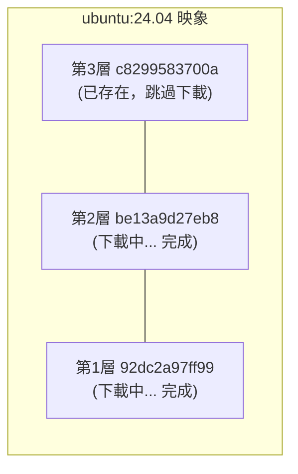

## 4.1 獲取映象

從 Docker 映象倉庫獲取映象可謂是 Docker 運作的第一步。本節將介紹如何使用 `docker pull` 指令下載映象，以及如何理解下載過程。

### docker pull 指令

從映象倉庫獲取映象的指令是 `docker pull`：

```bash
docker pull [選項] [Registry地址/]倉庫名[:標籤]
```

#### 映象名稱格式

Docker 映象名稱由 Registry 地址、使用者名、倉庫名和標籤組成。其標準格式如下：

```bash
docker.io / library / ubuntu : 24.04
────┬────   ───┬───   ──┬───   ──┬──
    │         │        │        │
Registry地址  使用者名    倉庫名    標籤
 (可省略)    (可省略)
```

| 組成部分 | 說明 | 預設值 |
|---------|------|--------|
| Registry 地址 | 映象倉庫地址 | `docker.io` (Docker Hub)|
| 使用者名 | 映象所屬使用者/組織 | `library` (官方映象)|
| 倉庫名 | 映象名稱 | 必須指定 |
| 標籤 | 版本標識 | `latest` |

#### 範例

執行以下指令：

```bash
## 完整格式

$ docker pull docker.io/library/ubuntu:24.04

## 省略 Registry（預設 Docker Hub）

$ docker pull library/ubuntu:24.04

## 省略 library（官方映象）

$ docker pull ubuntu:24.04

## 省略標籤（預設 latest）

$ docker pull ubuntu

## 拉取第三方映象

$ docker pull bitnami/redis:latest

## 從其他 Registry 拉取

$ docker pull ghcr.io/username/myapp:v1.0
```

---

### 下載過程解析

當我們執行 `docker pull` 指令時，Docker 會輸出詳細的下載進度。讓我們以 `ubuntu:24.04` 為例來解析這些訊息。

執行以下指令：

```bash
$ docker pull ubuntu:24.04
24.04: Pulling from library/ubuntu
92dc2a97ff99: Pull complete
be13a9d27eb8: Pull complete
c8299583700a: Pull complete
Digest: sha256:4bc3ae6596938cb0d9e5ac51a1152ec9dcac2a1c50829c74abd9c4361e321b26
Status: Downloaded newer image for ubuntu:24.04
docker.io/library/ubuntu:24.04
```

#### 輸出解讀

相關訊息如下表：

| 輸出內容 | 說明 |
|---------|------|
| `Pulling from library/ubuntu` | 正在從官方 ubuntu 倉庫拉取 |
| `92dc2a97ff99: Pull complete` | 各層的下載狀態 (顯示層 ID 前 12 位)|
| `Digest: sha256:...` | 映象內容的唯一摘要 |
| `docker.io/library/ubuntu:24.04` | 映象的完整名稱 |

#### 分層下載

從輸出可以看到，映象是 **分層下載** 的：



如果本地已有相同的層，Docker 會跳過下載，節省頻寬和時間。

---

### 常用選項

`docker pull` 指令支援多種選項來滿足不同的下載需求，例如下載所有標籤、指定平台架構等。

| 選項 | 說明 | 範例 |
|------|------|------|
| `--all-tags, -a` | 拉取所有標籤 | `docker pull -a ubuntu` |
| `--platform` | 指定平台架構 | `docker pull --platform linux/arm64 nginx` |
| `--quiet, -q` | 靜默模式 | `docker pull -q nginx` |

#### 概述

總體概述了以下內容。

#### 指定平台

在 Apple Silicon Mac 上拉取 x86 映象：

```bash
$ docker pull --platform linux/amd64 nginx
```

---

### 拉取後執行

拉取映象後，可以基於它啟動容器：

```bash
## 拉取映象

$ docker pull ubuntu:24.04

## 執行容器

$ docker run -it --rm ubuntu:24.04 bash
root@e7009c6ce357:/# cat /etc/os-release
PRETTY_NAME="Ubuntu 24.04 LTS"
...
root@e7009c6ce357:/# exit
```

**引數說明**：

| 引數 | 說明 |
|------|------|
| `-it` | 互動式終端模式 |
| `--rm` | 退出後自動刪除容器 |
| `bash` | 啟動指令 |

> 💡 `docker run` 在需要時會自動 `pull` 映象，因此通常不需要單獨執行 `docker pull`。

---

### 映象加速

從 Docker Hub 下載可能較慢。可以設定映象加速器：

```json
// /etc/docker/daemon.json (Linux)
// ~/.docker/daemon.json (Docker Desktop)
{
  "registry-mirrors": [
    "https://your-accelerator-url"
  ]
}
```

設定後重啟 Docker：

```bash
$ sudo systemctl restart docker  # Linux
## 或在 Docker Desktop 中重啟

## 或在 Docker Desktop 中重啟

```

詳見[映象加速器](../03_install/3.9_mirror.md)章節。

---

### 驗證映象完整性

為了確保下載的映象沒有被篡改且內容一致，我們可以校驗映象的摘要 (Digest)。

#### 檢視映象摘要

執行以下指令：

```bash
$ docker images --digests ubuntu
REPOSITORY   TAG     DIGEST                                                                    IMAGE ID
ubuntu       24.04   sha256:4bc3ae6596938cb0d9e5ac51a1152ec9dcac2a1c50829c74abd9c4361e321b26   ca2b0f26964c
```

#### 使用摘要拉取

用摘要拉取可確保獲取完全相同的映象：

```bash
$ docker pull ubuntu@sha256:4bc3ae6596938cb0d9e5ac51a1152ec9dcac2a1c50829c74abd9c4361e321b26
```

> 筆者建議：生產環境使用摘要而非標籤，因為標籤可能被覆蓋，摘要則是不可變的。

---

### 常見問題

在使用 `docker pull` 過程中，可能會遇到下載速度慢、映象不存在或磁碟空間不足等問題。以下是一些常見問題的排查思路。

#### Q：下載速度很慢

1. 設定映象加速器
2. 檢查網路連線
3. 嘗試拉取更小的映象版本 (如 `alpine` 變體)

#### Q：提示映象不存在

執行以下指令：

```bash
Error: pull access denied, repository does not exist
```

可能原因：

- 映象名拼寫錯誤
- 私有映象未登入 (需要 `docker login`)
- 映象確實不存在

#### Q：磁碟空間不足

執行以下指令：

```bash
## 清理未使用的映象

$ docker image prune

## 清理所有未使用資源

$ docker system prune
```

---
