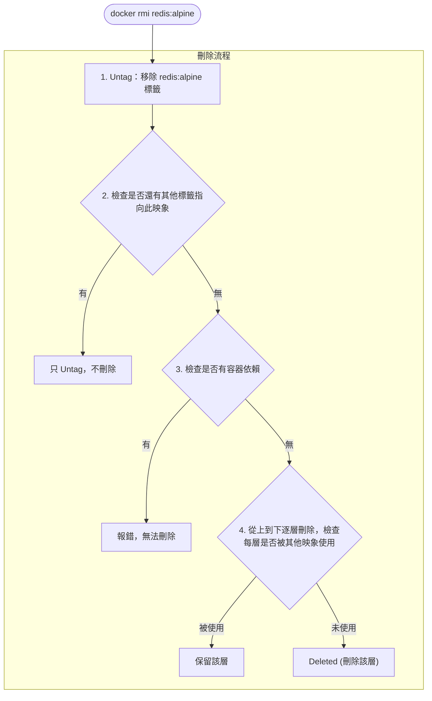

## 4.3 刪除本地映象

當不再需要某個映象時，我們可以將其刪除以釋放儲存空間。本節介紹刪除映象的常用方法。

### 4.3.1 基本用法

使用 `docker image rm` 刪除本地映象：

```bash
$ docker image rm [選項] <映象1> [<映象2> ...]
```

> 💡 `docker rmi` 是 `docker image rm` 的簡寫，兩者等效。

---

### 4.3.2 映象標識方式

刪除映象時，可以使用多種方式指定映象：

| 方式 | 說明 | 範例 |
|------|------|------|
| **短 ID** | ID 的前幾位 (通常 3-4 位)| `docker rmi 501` |
| **長 ID** | 完整的映象 ID | `docker rmi 501ad78535f0...` |
| **映象名:標籤** | 倉庫名和標籤 | `docker rmi redis:alpine` |
| **映象摘要** | 精確的內容摘要 | `docker rmi nginx@sha256:...` |

#### 使用短 ID 刪除

執行以下指令：

```bash
$ docker image ls
REPOSITORY   TAG     IMAGE ID       SIZE
redis        alpine  501ad78535f0   30MB
nginx        latest  e43d811ce2f4   142MB

## 只需輸入足夠區分的前幾位

$ docker rmi 501
Untagged: redis:alpine
Deleted: sha256:501ad78535f0...
```

#### 使用映象名刪除

執行以下指令：

```bash
$ docker rmi redis:alpine
Untagged: redis:alpine
Deleted: sha256:501ad78535f0...
```

#### 使用摘要刪除

摘要刪除最精確，適用於 CI/CD 場景：

```bash
## 檢視映象摘要

$ docker images --digests
REPOSITORY   TAG    DIGEST                   IMAGE ID
nginx        latest sha256:b4f0e0bdeb5...    e43d811ce2f4

## 使用摘要刪除

$ docker rmi nginx@sha256:b4f0e0bdeb578043c1ea6862f0d40cc4afe32a4a582f3be235a3b164422be228
```

---

### 4.3.3 理解輸出訊息

執行刪除指令後，Docker 會輸出一系列的操作記錄，理解這些訊息有助於我們掌握映象刪除的機制。

刪除映象時會看到兩類訊息：**Untagged** 和 **Deleted**

```bash
$ docker rmi redis:alpine
Untagged: redis:alpine
Untagged: redis@sha256:f1ed3708f538b537eb9c2a7dd50dc90a706f7debd7e1196c9264edeea521a86d
Deleted: sha256:501ad78535f015d88872e13fa87a828425117e3d28075d0c117932b05bf189b7
Deleted: sha256:96167737e29ca8e9d74982ef2a0dda76ed7b430da55e321c071f0dbff8c2899b
Deleted: sha256:32770d1dcf835f192cafd6b9263b7b597a1778a403a109e2cc2ee866f74adf23
```

#### Untagged vs Deleted

相關訊息如下表：

| 操作 | 含義 |
|------|------|
| **Untagged** | 移除映象的標籤 |
| **Deleted** | 刪除映象的儲存層 |

#### 刪除流程

Docker 會檢測映象是否有容器依賴或其他標籤指向，只有在確認為無用資源時才會真正刪除儲存層。



---

### 4.3.4 批次刪除

手動一個一個刪除映象非常繁瑣，Docker 提供了 `image prune` 指令和 shell 組合指令來實現批次清理。

#### 刪除所有虛懸映象

虛懸映象 (dangling)：沒有標籤的映象，通常是舊版本被新版本覆蓋後產生的

```bash
## 檢視虛懸映象

$ docker images -f dangling=true

## 刪除虛懸映象

$ docker image prune

## 不提示確認

$ docker image prune -f
```

#### 刪除所有未使用的映象

執行以下指令：

```bash
## 刪除所有沒有被容器使用的映象

$ docker image prune -a

## 保留最近 24 小時的

$ docker image prune -a --filter "until=24h"
```

#### 按條件刪除

執行以下指令：

```bash
## 刪除所有 redis 映象

$ docker rmi $(docker images -q redis)

## 刪除 mongo:8.0 之前的所有映象

$ docker rmi $(docker images -q -f before=mongo:8.0)

## 刪除某個時間之前的映象

$ docker image prune -a --filter "until=168h"  # 7天前
```

---

### 4.3.5 刪除失敗的常見原因

在刪除映象時，Docker 可能會提示錯誤並拒絕執行。這通常是為了防止誤刪正在使用的資源。

#### 原因一：有容器依賴

執行以下指令：

```bash
$ docker rmi nginx
Error: conflict: unable to remove repository reference "nginx" 
(must force) - container abc123 is using its referenced image
```

**解決方案**：

```bash
## 方案1：先刪除依賴的容器

$ docker rm abc123
$ docker rmi nginx

## 方案2：強制刪除映象（容器仍可執行，但無法再建立新容器）

$ docker rmi -f nginx
```

#### 原因二：多個標籤指向同一映象

執行以下指令：

```bash
$ docker images
REPOSITORY   TAG     IMAGE ID
ubuntu       24.04   ca2b0f26964c
ubuntu       latest  ca2b0f26964c   # 同一個映象

$ docker rmi ubuntu:24.04
Untagged: ubuntu:24.04
## 只是移除標籤，映象仍存在（因為還有 ubuntu:latest 指向它）

當同一個映象有多個標籤時，`docker rmi` 只是刪除指定的標籤，不會刪除映象本身。

```

#### 原因三：被其他映象依賴 (中間層)

執行以下指令：

```bash
$ docker rmi some_base_image
Error: image has dependent child images
```

中間層映象被其他映象依賴，無法刪除。需要先刪除依賴它的映象。

---

### 4.3.6 常用過濾條件

相關訊息如下表：

| 過濾條件 | 說明 | 範例 |
|---------|------|------|
| `dangling=true` | 虛懸映象 | `-f dangling=true` |
| `before=映象` | 在某映象之前 | `-f before=mongo:3.2` |
| `since=映象` | 在某映象之後 | `-f since=mongo:3.2` |
| `label=key=value` | 按標籤過濾 | `-f label=version=1.0` |
| `reference=pattern` | 按名稱模式 | `-f reference='*:latest'` |

---

### 4.3.7 清理策略

針對不同的環境 (開發環境 vs 生產環境)，我們應該採用不同的映象清理策略。

#### 開發環境

執行以下指令：

```bash
## 定期清理虛懸映象

$ docker image prune -f

## 一鍵清理所有未使用資源

$ docker system prune -a
```

#### CI/CD 環境

執行以下指令：

```bash
## 只保留最近使用的映象

$ docker image prune -a --filter "until=72h" -f
```

#### 檢視空間佔用

執行以下指令：

```bash
$ docker system df
TYPE            TOTAL   ACTIVE   SIZE      RECLAIMABLE
Images          15      3        2.5GB     1.8GB (72%)
Containers      5       2        100MB     80MB (80%)
Local Volumes   8       2        500MB     400MB (80%)
Build Cache     0       0        0B        0B
```

---
