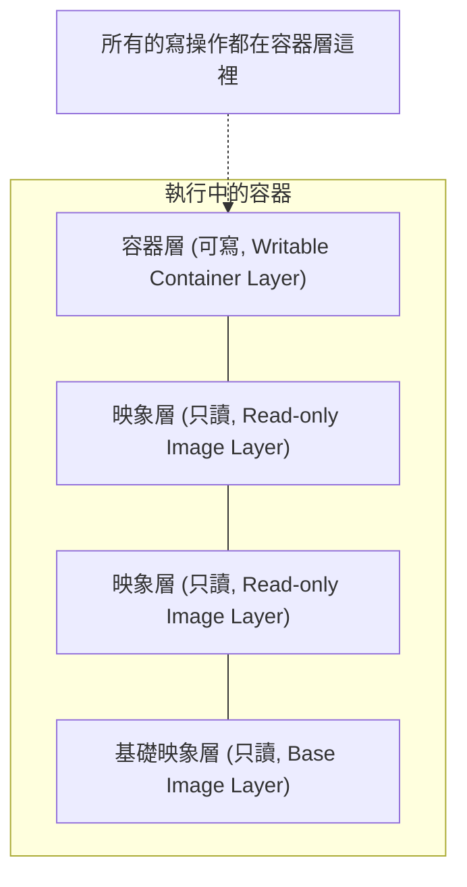

## 4.7 實現原理

Docker 映象是怎麼實現增量的修改和維護的？為什麼容器啟動如此之快？這一切都歸功於 Docker 的映象分層儲存設計。

### 映象與分層儲存

在之前的章節中，我們一直強調映象包含作業系統完整的 `root` 檔案系統，其體積往往是龐大的。因此在 Docker 設計時，就充分利用 **Union FS** 的技術，將其設計為分層儲存的架構。

Docker 映象並不是一個單純的檔案，而是由一組檔案系統疊加構成的。

最底層的映象稱為 **基礎映象 (Base Image)**，通常是各種 Linux 發行版的 root 檔案系統，如 Ubuntu、Debian、CentOS 等。

當我們在基礎映象之上建立新的映象時 (例如安裝了 Nginx)，Docker 並不是複製一份基礎映象，而是在基礎映象之上，**新建一個層 (Layer)**，並在該層中僅記錄為了安裝 Nginx 而發生的檔案變更 (新增、修改、刪除)。

這種分層儲存結構使得映象的複用、分發變得非常高效：

*   **複用**：如果多個映象都基於同一個基礎映象 (例如都基於 `ubuntu:24.04`)，那麼宿主機只需要下載一份 `ubuntu:24.04`，所有映象都可以共享它。
*   **輕量**：映象僅僅記錄了與基礎映象的差異，因此體積非常小。

### 容器層與讀寫

我們要理解的一個關鍵概念是：**映象的每一層都是隻讀的 (Read-only)**。

那麼，既然映象只讀，容器為什麼能寫檔案呢？

當容器啟動時，Docker 會在映象的最上層，新增一個新的 **可寫層 (Writable Layer)**，通常被稱為 **容器層**。

*   **讀取檔案**：當容器需要讀取檔案時，Docker 會從最上層 (容器層) 開始向下層 (映象層) 尋找，直到找到該檔案為止。
*   **修改檔案**：當容器需要修改某個檔案時，Docker 會從下層映象中將該檔案複製到上層的容器層，然後對副本進行修改。這被稱為 **寫時複製 (Copy-on-Write，CoW)** 策略。
*   **刪除檔案**：當容器刪除某個檔案時，Docker 並不是真的去下層刪除它 (因為下層是隻讀的)，而是在容器層建立一個特殊的 『白障 (Whiteout)』 檔案，用來標記該檔案已被刪除，從而在容器檢視中隱藏它。

這就是為什麼：

1.  **容器刪除後資料會丟失**：因為所有的資料修改都儲存在最上層的容器層中，容器銷燬時，這個層也就隨之銷燬了。(除非使用了資料卷，詳見[資料管理](../08_data_network/README.md))。
2.  **映象不可變**：無論我們在容器裡刪除了多少檔案，基礎映象的體積並不會減小，因為它們依然存在於底層的只讀層中。

### 內容定址與映象 ID

Docker 映象的每一層都有一個唯一的 ID，這個 ID 是根據該層的內容計算出來的雜湊值 (SHA256)。這意味著：

*   **內容即 ID**：只要層的內容有一丁點變化，ID 就會變。
*   **安全性**：確保了映象內容的完整性，下載過程中如果資料損壞，ID 校驗就會失敗。
*   **去重**：如果兩個不同的映象 (甚至是不同來源的映象) 包含相同的層 (ID 相同)，Docker 引擎在本地只會儲存一份，絕不重複下載。

### 聯合檔案系統

Docker 使用聯合檔案系統 (Union FS) 來實現這種分層掛載。常見的驅動包括 `overlay2` (目前推薦)、`aufs` (早期使用)、`btrfs`、`zfs` 等。

雖然實現細節不同，但它們都遵循上述的 **分層 + CoW** 模型。

> 想要深入瞭解 Overlay2 等檔案系統的具體實現原理，包括 WorkDir、UpperDir、LowerDir 等底層細節，請閱讀 **[第十四章底層實現](../14_implementation/README.md)** 中的 **[聯合檔案系統](../14_implementation/14.4_ufs.md)** 章節。
