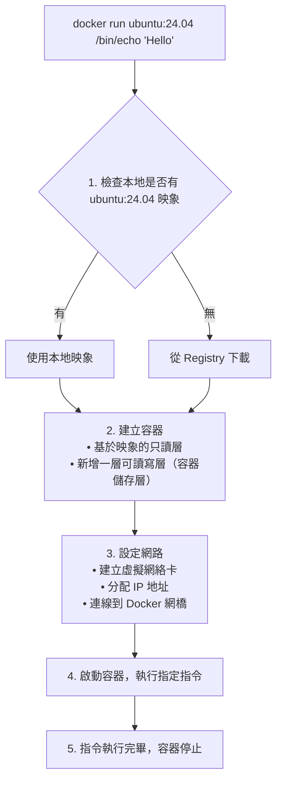

## 5.1 啟動

本節將詳細介紹 Docker 容器的啟動方式，包括新建啟動和重新啟動已停止的容器。

### 5.1.1 啟動方式概述

啟動容器有兩種方式：

- **新建並啟動**：基於映象建立新容器
- **重新啟動**：將已終止的容器重新執行

由於 Docker 容器非常輕量，實際使用中常常是隨時刪除和新建容器，而不是反覆重啟同一個容器。

### 5.1.2 新建並啟動

#### 基本語法

```bash
docker run [選項] 映象 [指令] [引數...]
```

#### 最簡單的例子

輸出 『Hello World』 後容器自動終止：

```bash
$ docker run ubuntu:24.04 /bin/echo 'Hello world'
Hello world
```

這與直接執行 `/bin/echo 'Hello world'` 幾乎沒有區別，但實際上已經啟動了一個完整的 Ubuntu 容器來執行這條指令。

#### 互動式容器

啟動一個可以互動的 bash 終端：

```bash
$ docker run -it ubuntu:24.04 /bin/bash
root@af8bae53bdd3:/#
```

**引數說明**：

| 引數 | 作用 |
|------|------|
| `-i` | 保持標準輸入 (stdin) 開啟，允許輸入 |
| `-t` | 分配偽終端 (pseudo-TTY)，提供終端介面 |
| `-it` | 兩者組合使用，獲得互動式終端 |

在互動模式下可以執行指令：

```bash
root@af8bae53bdd3:/# pwd
/
root@af8bae53bdd3:/# ls
bin boot dev etc home lib lib64 media mnt opt proc root run sbin srv sys tmp usr var
root@af8bae53bdd3:/# exit  # 退出容器
```

### 5.1.3 docker run 的完整流程

執行 `docker run` 時，Docker 在後台完成以下操作：



### 5.1.4 常用啟動選項

#### 基礎選項

| 選項 | 說明 | 範例 |
|------|------|------|
| `-d` | 後台執行 (detach)| `docker run -d nginx` |
| `-it` | 互動式終端 | `docker run -it ubuntu bash` |
| `--name` | 指定容器名稱 | `docker run --name myapp nginx` |
| `--rm` | 退出後自動刪除容器 | `docker run --rm ubuntu echo hi` |

#### 連接埠對映

```bash
## 將容器的 80 連接埠對映到宿主機的 8080 連接埠

$ docker run -d -p 8080:80 nginx

## 隨機對映連接埠

$ docker run -d -P nginx

## 只繫結到 localhost

$ docker run -d -p 127.0.0.1:8080:80 nginx
```

#### 資料卷掛載

```bash
## 掛載命名卷

$ docker run -v mydata:/data nginx

## 掛載宿主機目錄

$ docker run -v /host/path:/container/path nginx

## 只讀掛載

$ docker run -v /host/path:/container/path:ro nginx
```

#### 環境變數

```bash
## 設定單個環境變數

$ docker run -e MYSQL_ROOT_PASSWORD=secret mysql

## 從檔案載入環境變數

$ docker run --env-file .env myapp
```

#### 資源限制

```bash
## 限制記憶體

$ docker run -m 512m nginx

## 限制 CPU

$ docker run --cpus=1.5 nginx
```

### 5.1.5 啟動已終止容器

使用 `docker start` 重新啟動已停止的容器：

```bash
## 檢視所有容器（包括已停止的）

$ docker ps -a
CONTAINER ID  IMAGE   STATUS                     NAMES
af8bae53bdd3  ubuntu  Exited (0) 2 minutes ago   myubuntu

## 重新啟動

$ docker start myubuntu

## 啟動並附加終端

$ docker start -ai myubuntu
```

### 5.1.6 容器內程序的特點

容器內只執行指定的應用程式及其必需資源：

```bash
root@ba267838cc1b:/# ps
  PID TTY          TIME CMD
    1 ?        00:00:00 bash
   11 ?        00:00:00 ps
```

可見容器中僅執行了 `bash` 程序。這種特點使得 Docker 對資源的利用率極高。

> 💡 筆者提示：容器內的 PID 1 程序很重要——它是容器的主程序，該程序退出則容器停止。詳見[後台執行](5.2_daemon.md)章節。

### 5.1.7 常見問題

#### Q：容器啟動後立即退出

**原因**：主程序執行完畢或無法保持執行

```bash
## 這個容器會立即退出（echo 執行完就結束了）

$ docker run ubuntu echo "hello"

## 解決：使用能持續執行的指令

$ docker run -d nginx  # nginx 是持續執行的服務
```

詳細解釋見[後台執行](5.2_daemon.md)。

#### Q：無法連線容器內的服務

**原因**：未正確對映連接埠

```bash
## 錯誤：沒有 -p 引數，外部無法訪問

$ docker run -d nginx

## 正確：對映連接埠

$ docker run -d -p 80:80 nginx
```

#### Q：容器內修改的檔案丟失

**原因**：未使用資料卷，資料儲存在容器儲存層

```bash
## 使用資料卷持久化

$ docker run -v mydata:/app/data myapp
```

詳見[資料管理](../08_data/README.md)。
