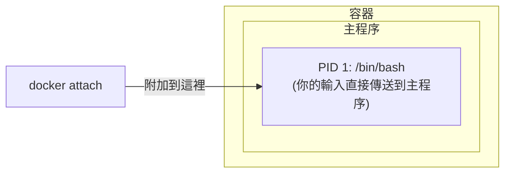
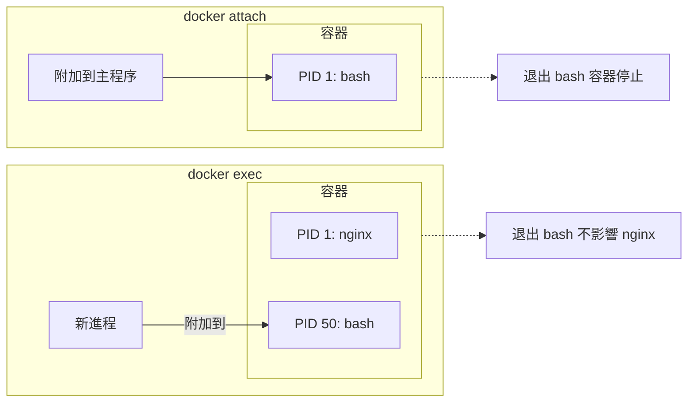

## 5.4 進入容器

本節涵蓋了相關內容與詳細描述，主要探討以下幾個方面：

### 為什麼需要進入容器

使用 `-d` 引數啟動容器後，容器在後台執行。以下場景需要進入容器內部操作：

| 場景 | 範例 |
|------|------|
| **除錯問題** | 檢視日誌、檢查設定、排查錯誤 |
| **臨時操作** | 執行資料庫遷移、清理快取 |
| **檢查狀態** | 檢視程序、網路連線、檔案系統 |
| **開發測試** | 互動式測試指令、驗證環境 |

### 兩種進入方式

Docker 提供兩種進入容器的指令：

| 指令 | 推薦程度 | 特點 |
|------|---------|------|
| `docker exec` | ✅ **推薦** | 啟動新進程，退出不影響容器 |
| `docker attach` | ⚠️ 謹慎使用 | 附加到主程序，退出可能停止容器 |

---

### docker exec (推薦)

本節涵蓋了相關內容與詳細描述，主要探討以下幾個方面：

#### docker exec 基本用法

執行以下指令：

```bash
## 進入容器並啟動互動式 shell

$ docker exec -it 容器名 /bin/bash

## 或使用 sh（適用於 Alpine 等精簡映象）

$ docker exec -it 容器名 /bin/sh
```

#### 引數說明

相關訊息如下表：

| 引數 | 作用 |
|------|------|
| `-i` | 保持標準輸入開啟 (interactive)|
| `-t` | 分配偽終端 (TTY)|
| `-it` | 兩者組合，獲得完整互動體驗 |
| `-u` | 指定使用者 (如 `-u root`)|
| `-w` | 指定工作目錄 |
| `-e` | 設定環境變數 |

#### docker exec 範例

執行以下指令：

```bash
## 啟動一個後台容器

$ docker run -dit --name myubuntu ubuntu
69d137adef7a...

## 進入容器（互動式 shell）

$ docker exec -it myubuntu bash
root@69d137adef7a:/# ls
bin  boot  dev  etc  home  lib  ...
root@69d137adef7a:/# exit

## 容器仍在執行！

$ docker ps
CONTAINER ID   IMAGE    STATUS         NAMES
69d137adef7a   ubuntu   Up 2 minutes   myubuntu
```

#### 執行單條指令

不進入互動模式，直接執行指令：

```bash
## 檢視容器內程序

$ docker exec myubuntu ps aux

## 檢視設定檔案

$ docker exec myubuntu cat /etc/nginx/nginx.conf

## 以 root 使用者執行

$ docker exec -u root myubuntu apt update
```

#### 只用 -i 不用 -t 的區別

執行以下指令：

```bash
## 只用 -i：可以執行指令，但沒有提示符

$ docker exec -i myubuntu bash
ls           # 輸入指令
bin          # 輸出結果
boot
dev
...

## 用 -it：有完整的終端體驗

$ docker exec -it myubuntu bash
root@69d137adef7a:/#    # 有提示符
```

> 💡 通常使用 `-it` 組合。只有在指令碼中需要透過通道傳入指令時才只用 `-i`。

---

### docker attach (謹慎使用)

本節涵蓋了相關內容與詳細描述，主要探討以下幾個方面：

#### docker attach 基本用法

執行以下指令：

```bash
$ docker attach 容器名
```

#### 工作原理

`attach` 會附加到容器的 **主程序** (PID 1) 的標準輸入輸出：



#### docker attach 範例

執行以下指令：

```bash
## 啟動容器

$ docker run -dit --name myubuntu ubuntu
243c32535da7...

## 附加到容器

$ docker attach myubuntu
root@243c32535da7:/#
```

#### ⚠️ 重要警告

**從 attach 會話中輸入 `exit` 或按 `Ctrl+D` 會導致容器停止！**

```bash
$ docker attach myubuntu
root@243c32535da7:/# exit    # 這會停止容器！

$ docker ps
CONTAINER ID   IMAGE    STATUS                     NAMES
243c32535da7   ubuntu   Exited (0) 2 seconds ago   myubuntu
```

**原因**：attach 附加到主程序，退出主程序就等於退出容器。

#### 安全退出 attach

使用 `Ctrl+P` 然後 `Ctrl+Q` 可以從 attach 會話中 **分離**，而不停止容器：

```bash
$ docker attach myubuntu
root@243c32535da7:/# 
## 按 Ctrl+P 然後 Ctrl+Q

read escape sequence

$ docker ps    # 容器仍在執行
CONTAINER ID   IMAGE    STATUS         NAMES
243c32535da7   ubuntu   Up 5 minutes   myubuntu
```

---

### exec vs attach 對比

相關訊息如下表：

| 屬性 | docker exec | docker attach |
|------|-------------|---------------|
| **工作方式** | 在容器內啟動新進程 | 附加到主程序 |
| **退出影響** | 不影響容器 | 可能停止容器 |
| **多終端** | 可以開多個 | 共享同一個會話 |
| **適用場景** | 除錯、臨時操作 | 檢視主程序輸出 |
| **推薦程度** | ✅ 推薦 | ⚠️ 特殊場景使用 |



---

### 最佳實踐

本節涵蓋了相關內容與詳細描述，主要探討以下幾個方面：

#### 1。首選 docker exec

執行以下指令：

```bash
## 進入容器除錯

$ docker exec -it myapp bash

## 檢視日誌

$ docker exec myapp tail -f /var/log/app.log

## 執行資料庫遷移

$ docker exec myapp python manage.py migrate
```

#### 2。生產環境避免進入容器

筆者建議：生產環境應儘量避免進入容器直接操作，而是透過：

- 日誌系統檢視日誌 (如 `docker logs` 或集中式日誌)
- 監控系統檢視狀態
- 重新部署而非手動修改

#### 3。無 shell 映象的處理

某些精簡映象 (如基於 `scratch` 或 `distroless`) 沒有 shell：

```bash
## 這會失敗

$ docker exec -it myapp bash
OCI runtime exec failed: exec failed: unable to start container process: exec: "bash": executable file not found

## 解決方案：使用除錯容器（Docker Desktop 或 Kubernetes debug）

$ docker debug myapp
```

---

### 常見問題

本節涵蓋了相關內容與詳細描述，主要探討以下幾個方面：

#### Q：exec 進入後看不到其他終端的操作

這是正常的。exec 啟動的是獨立程序，多個 exec 會話互不影響。

#### Q：容器沒有 bash

嘗試使用 sh：

```bash
$ docker exec -it myapp /bin/sh
```

#### Q：需要 root 許可權

執行以下指令：

```bash
$ docker exec -u root -it myapp bash
```

---
