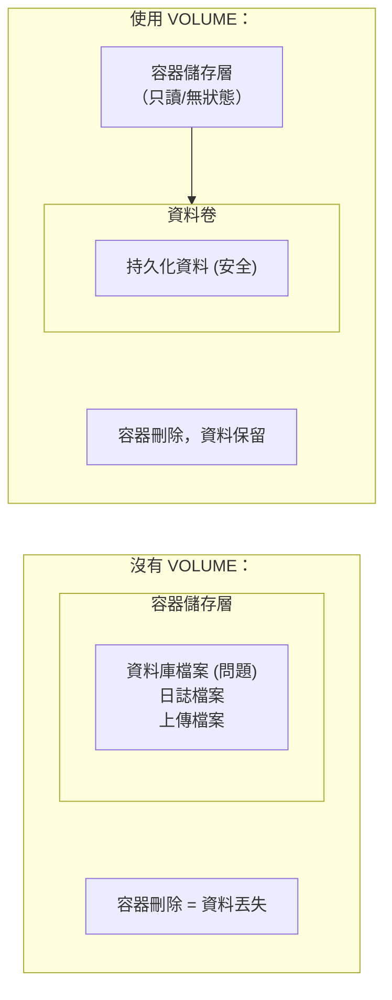

## 7.8 VOLUME 定義匿名卷

### 7.8.1 基本語法

```docker
VOLUME ["/路徑1", "/路徑2"]
VOLUME /路徑
```
`VOLUME` 指令建立掛載點，並標記為外部掛載的卷。

---

### 7.8.2 為什麼使用 VOLUME

> **核心原則**：容器儲存層應該保持無狀態，任何執行時資料都應該儲存在卷中。


```mermaid
flowchart LR
    subgraph NoVolume ["沒有 VOLUME："]
        direction TB
        subgraph Container1 ["容器儲存層"]
            direction TB
            Files["資料庫檔案 (問題)<br/>日誌檔案<br/>上傳檔案"]
        end
        Result1["容器刪除 = 資料丟失"]
        Container1 ~~~ Result1
    end

    subgraph UseVolume ["使用 VOLUME："]
        direction TB
        Container2["容器儲存層<br/>（只讀/無狀態）"]
        subgraph Volume ["資料卷"]
            Data["持久化資料 (安全)"]
        end
        Container2 --> Volume
        Result2["容器刪除，資料保留"]
        Volume ~~~ Result2
    end
```
---

### 7.8.3 基本用法

#### 定義單個卷

```docker
FROM mysql:8.4
VOLUME /var/lib/mysql
```

#### 定義多個卷

```docker
FROM myapp
VOLUME ["/data", "/logs", "/config"]
```
---

### 7.8.4 VOLUME 的行為

#### 1. 自動建立匿名卷

如果執行時未指定掛載，Docker 會自動建立匿名卷：

```bash
$ docker run mysql:8.4
$ docker volume ls
DRIVER    VOLUME NAME
local     a1b2c3d4e5f6...  # 自動建立的匿名卷
```

#### 2. 可被命名卷覆蓋

```bash
## 使用命名卷替代匿名卷

$ docker run -v mysql_data:/var/lib/mysql mysql:8.4
```

#### 3. 可被 Bind Mount 覆蓋

```bash
## 使用宿主機目錄替代

$ docker run -v /my/data:/var/lib/mysql mysql:8.4
```
---

### 7.8.5 VOLUME 在建立時的特殊行為

> ⚠️ **重要**：`VOLUME` 之後再寫入該目錄的建立語義取決於 builder。legacy builder 會丟棄這些修改；BuildKit 會保留。但執行容器時，一旦該路徑掛載了卷，卷會遮蔽映象內同路徑的內容。

```docker
FROM ubuntu
VOLUME /data

## ⚠️ legacy builder 會丟棄；BuildKit 會保留，但執行時掛載卷會遮蔽它

RUN echo "hello" > /data/test.txt
```
**原因**：舊 builder 會在建立過程中為該目錄建立臨時匿名卷，後續寫入發生在臨時卷中；BuildKit 則會把修改保留在映象層。為了避免不同 builder 下出現不同結果，也為了避免執行時卷遮蔽映象內初始化資料，不要把必須存在的初始化檔案寫在 `VOLUME` 之後。

#### 正確做法

```docker
FROM ubuntu

## ✅ 先寫入檔案

RUN mkdir -p /data && echo "hello" > /data/test.txt

## 再宣告 VOLUME

VOLUME /data
```
---

### 7.8.6 常見使用場景

#### 資料庫持久化

```docker
# 建議使用 postgres:16 或 postgres:latest，具體版本號根據資料庫相容性需求選擇
FROM postgres:16
VOLUME /var/lib/postgresql/data
```

#### 日誌目錄

```docker
FROM nginx
VOLUME /var/log/nginx
```

#### 上傳檔案目錄

```docker
FROM myapp
VOLUME /app/uploads
```
---

### 7.8.7 檢視 VOLUME 定義

```bash
## 檢視映象定義的 VOLUME

$ docker inspect mysql:8.4 --format '{{json .Config.Volumes}}' | jq
{
  "/var/lib/mysql": {}
}

## 檢視容器掛載的卷

$ docker inspect mycontainer --format '{{json .Mounts}}' | jq
```
---

### 7.8.8 VOLUME vs docker run -v

| 屬性 | Dockerfile VOLUME | docker run -v |
|------|-------------------|---------------|
| **定義時機** | 映象建立時 | 容器執行時 |
| **預設行為** | 建立匿名卷 | 可指定命名卷或路徑 |
| **靈活性** | 低 (固定路徑)| 高 (可任意指定)|
| **適用場景** | 定義必須持久化的路徑 | 靈活的資料管理 |

---

### 7.8.9 在 Compose 中

在 Compose 中設定如下：

```yaml
services:
  db:
    # 建議使用 postgres:16 或其他具體版本，避免 latest
    image: postgres:16
    volumes:
      # 命名卷（推薦）

      - postgres_data:/var/lib/postgresql/data
      # Bind Mount

      - ./init.sql:/docker-entrypoint-initdb.d/init.sql

volumes:
  postgres_data:  # 宣告命名卷
```
---

### 7.8.10 安全注意事項

#### 匿名卷可能導致資料丟失

```bash
## 使用 --rm 執行的容器，匿名卷會在容器刪除時一起刪除

$ docker run --rm mysql:8.4

## 容器停止後，資料丟失！

...
```
**解決**：始終使用命名卷

```bash
$ docker run -v mysql_data:/var/lib/mysql mysql:8.4
```
---

### 7.8.11 最佳實踐

#### 1. 定義必須持久化的路徑

```docker
## 資料庫必須使用卷

FROM postgres:16
VOLUME /var/lib/postgresql/data
```

#### 2. 不要在 VOLUME 後修改目錄

```docker
## ❌ 避免

VOLUME /app/data
RUN cp init-data.json /app/data/

## ✅ 正確

RUN mkdir -p /app/data && cp init-data.json /app/data/
VOLUME /app/data
```

#### 3. 文件中說明 VOLUME 用途

```docker
## 持久化使用者上傳的檔案

VOLUME /app/uploads

## 持久化資料庫資料

VOLUME /var/lib/mysql
```
---
