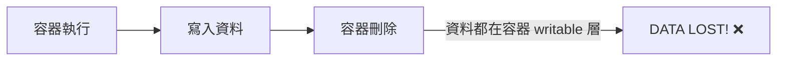
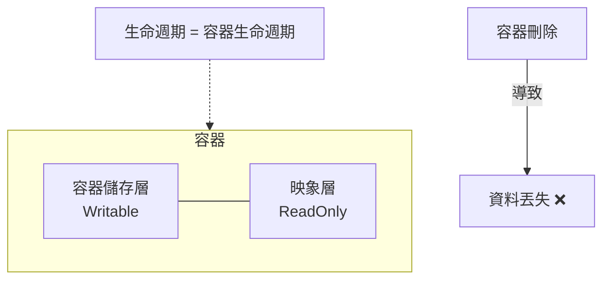
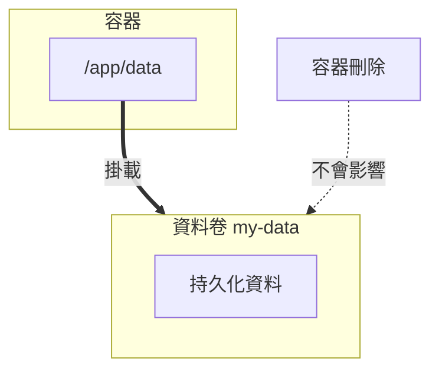

## 8.1 資料卷

### 8.1.1 為什麼需要資料卷

容器的儲存層有一個關鍵問題：**容器刪除後，資料就沒了**。



資料卷 (Volume) 解決了這個問題，它的生命週期獨立於容器。

---

### 8.1.2 資料卷的屬性

| 屬性 | 說明 |
|------|------|
| **持久化** | 容器刪除後資料仍然保留 |
| **共享** | 多個容器可以掛載同一個資料卷 |
| **即時生效** | 對資料卷的修改立即可見 |
| **不影響映象** | 資料卷中的資料不會打包進映象 |
| **效能更好** | 繞過 UnionFS，直接讀寫 |

---

### 8.1.3 資料卷 vs 容器儲存層

#### 容器儲存層 (不推薦儲存重要資料)



#### 資料卷 (推薦)



---

### 8.1.4 資料卷基本操作

#### 建立資料卷

```bash
$ docker volume create my-vol
```

#### 列出所有資料卷

```bash
$ docker volume ls
DRIVER    VOLUME NAME
local     my-vol
local     postgres_data
local     redis_data
```

#### 檢視資料卷詳情

```bash
$ docker volume inspect my-vol
[
    {
        "CreatedAt": "2026-01-15T10:00:00Z",
        "Driver": "local",
        "Labels": {},
        "Mountpoint": "/var/lib/docker/volumes/my-vol/_data",
        "Name": "my-vol",
        "Options": {},
        "Scope": "local"
    }
]
```

**關鍵字段**：

- `Mountpoint`：資料卷在宿主機上的實際儲存位置
- `Driver`：儲存驅動 (預設 local，也可以用第三方驅動)

---

### 8.1.5 掛載資料卷

#### 方式一：--mount (推薦)

```bash
$ docker run -d \
    --name web \
    --mount source=my-vol,target=/usr/share/nginx/html \
    nginx
```

**引數說明**：

| 引數 | 說明 |
|------|------|
| `source` | 資料卷名稱 (不存在會自動建立)|
| `target` | 容器內掛載路徑 |
| `readonly` | 可選，只讀掛載 |

#### 方式二：-v (簡寫)

```bash
$ docker run -d \
    --name web \
    -v my-vol:/usr/share/nginx/html \
    nginx
```

**格式**：`-v 資料卷名:容器路徑[:選項]`

#### 兩種方式對比

| 屬性 | --mount | -v |
|------|---------|-----|
| 語法 | 鍵值對，更清晰 | 冒號分隔，更簡潔 |
| 自動建立卷 | source 不存在會報錯 | 自動建立 |
| 推薦程度 | ✅ 推薦 (更明確)| 常用 (更簡潔)|

#### 只讀掛載

```bash
## --mount 方式

$ docker run -d \
    --mount source=my-vol,target=/data,readonly \
    nginx

## -v 方式

$ docker run -d \
    -v my-vol:/data:ro \
    nginx
```

---

### 8.1.6 使用場景範例

#### 場景一：資料庫持久化

```bash
## 建立資料卷

$ docker volume create postgres_data

## 啟動 PostgreSQL，資料儲存在資料卷中

$ docker run -d \
    --name postgres \
    -e POSTGRES_PASSWORD=secret \
    -v postgres_data:/var/lib/postgresql/data \
    postgres:16

## 即使刪除容器，資料仍然保留

$ docker rm -f postgres

## 重新啟動，資料還在

$ docker run -d \
    --name postgres \
    -e POSTGRES_PASSWORD=secret \
    -v postgres_data:/var/lib/postgresql/data \
    postgres:16
```

#### 場景二：多容器共享資料

```bash
## 建立共享資料卷

$ docker volume create shared-data

## 容器 A 寫入資料

$ docker run -d --name writer \
    -v shared-data:/data \
    alpine sh -c "while true; do date >> /data/log.txt; sleep 5; done"

## 容器 B 讀取資料

$ docker run --rm \
    -v shared-data:/data \
    alpine cat /data/log.txt
```

#### 場景三：設定檔案持久化

```bash
## 將 nginx 設定儲存在資料卷中

$ docker run -d \
    -v nginx-config:/etc/nginx/conf.d \
    -v nginx-logs:/var/log/nginx \
    -p 80:80 \
    nginx
```

---

### 8.1.7 資料卷管理

#### 刪除資料卷

```bash
## 刪除指定資料卷

$ docker volume rm my-vol

## 刪除容器時同時刪除資料卷

$ docker rm -v container_name
```

#### 清理未使用的資料卷

```bash
## 檢視未被任何容器使用的資料卷

$ docker volume ls -f dangling=true

## 刪除所有未使用的資料卷

$ docker volume prune

## 強制刪除（不提示確認）

$ docker volume prune -f
```

> ⚠️ **注意**：資料卷不會自動垃圾回收。長期執行的系統應定期清理無用資料卷。

---

### 8.1.8 資料卷備份與恢復

#### 備份資料卷

```bash
## 使用臨時容器掛載資料卷，打包備份

$ docker run --rm \
    -v my-vol:/source:ro \
    -v $(pwd):/backup \
    alpine tar czf /backup/my-vol-backup.tar.gz -C /source .
```

**原理**：

1. 建立臨時容器
2. 掛載要備份的資料捲到 `/source`
3. 掛載當前目錄到 `/backup`
4. 使用 tar 打包

#### 恢復資料卷

```bash
## 建立新資料卷

$ docker volume create my-vol-restored

## 解壓備份到新資料卷

$ docker run --rm \
    -v my-vol-restored:/target \
    -v $(pwd):/backup:ro \
    alpine tar xzf /backup/my-vol-backup.tar.gz -C /target
```

#### 備份指令碼範例

```bash
#!/bin/bash
## backup-volume.sh

VOLUME_NAME=$1
BACKUP_DIR=${2:-/backups}
TIMESTAMP=$(date +%Y%m%d_%H%M%S)

docker run --rm \
    -v ${VOLUME_NAME}:/source:ro \
    -v ${BACKUP_DIR}:/backup \
    alpine tar czf /backup/${VOLUME_NAME}_${TIMESTAMP}.tar.gz -C /source .

echo "Backed up ${VOLUME_NAME} to ${BACKUP_DIR}/${VOLUME_NAME}_${TIMESTAMP}.tar.gz"
```

---

### 8.1.9 資料卷 vs 繫結掛載

Docker 有兩種主要的資料持久化方式：

| 屬性 | 資料卷 (Volume) | 繫結掛載 (Bind Mount) |
|------|----------------|---------------------|
| **管理方式** | Docker 管理 | 使用者管理 |
| **儲存位置** | `/var/lib/docker/volumes/` | 任意宿主機路徑 |
| **可移植性** | 更好 | 依賴宿主機路徑 |
| **適用場景** | 生產資料持久化 | 開發時同步程式碼 |
| **備份** | 需要工具 | 直接訪問檔案 |

```bash
## 資料卷

$ docker run -v mydata:/app/data nginx

## 繫結掛載

$ docker run -v /host/path:/app/data nginx
```

詳見[繫結掛載](8.2_bind-mounts.md)章節。

---

### 8.1.10 常見問題

#### Q：如何知道容器使用了哪些資料卷？

```bash
$ docker inspect container_name --format '{{json .Mounts}}' | jq
```

#### Q：資料卷的資料在哪裡？

```bash
## 檢視資料卷詳情

$ docker volume inspect my-vol

## Mountpoint 欄位顯示實際路徑

"Mountpoint": "/var/lib/docker/volumes/my-vol/_data"
```

> ⚠️ **注意**：不建議直接修改 Mountpoint 中的檔案，應透過容器操作。

#### Q：如何在不同機器間遷移資料卷？

1. 在源機器備份：`docker run --rm -v mydata:/data -v $(pwd):/backup alpine tar czf /backup/data.tar.gz -C /data .`
2. 傳輸 tar.gz 檔案
3. 在目標機器恢復

---
