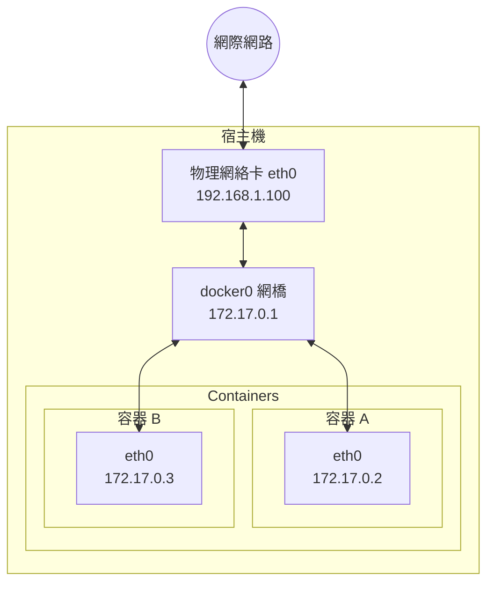

# 網路設定

## Docker 網路概述

Docker 容器需要網路來：
- 與外部世界通訊（訪問網際網路、被外部訪問）
- 容器之間相互通訊
- 與宿主機通訊

Docker 在安裝時會自動設定網路基礎設施，大多數情況下開箱即用。

## 預設網路架構

Docker 啟動時自動建立以下網路元件：



### 核心元件

| 元件 | 說明 |
|------|------|
| **docker0** | 虛擬網橋，充當交換機角色 |
| **veth pair** | 虛擬網絡卡對，一端在容器內，一端連線網橋 |
| **容器 eth0** | 容器內的網絡卡 |
| **IP 地址** | 自動從 172.17.0.0/16 網段分配 |

### 資料流向

```
容器 A (172.17.0.2) → docker0 → 容器 B (172.17.0.3)  (容器間通訊)
容器 A (172.17.0.2) → docker0 → eth0 → 網際網路        (訪問外網)
外部請求 → eth0 → docker0 → 容器 A                    (被外部訪問，需連接埠對映)
```

---

## Docker 網路型別

檢視預設網路：

```bash
$ docker network ls
NETWORK ID     NAME      DRIVER    SCOPE
abc123...      bridge    bridge    local
def456...      host      host      local
ghi789...      none      null      local
```

| 網路型別 | 說明 | 適用場景 |
|---------|------|---------|
| **bridge** | 預設類型，容器連線到虛擬網橋 | 大多數單機場景 |
| **host** | 容器直接使用宿主機網路棧 | 需要最高網路效能時 |
| **none** | 停用網路 | 完全隔離的容器 |
| **overlay** | 跨主機網路 | Docker Swarm 叢集 |
| **macvlan** | 容器擁有獨立 MAC 地址 | 需要直接接入物理網路 |

---

## 使用者自定義網路（推薦）

### 為什麼要用自定義網路

預設 bridge 網路的侷限：

| 問題 | 自定義網路的優勢 |
|------|-----------------|
| 只能用 IP 通訊 | 支援容器名 DNS 解析 |
| 所有容器在同一網路 | 更好的隔離性 |
| 需要 --link（已廢棄） | 原生支援服務發現 |

### 建立自定義網路

執行以下指令：

```bash
## 建立網路

$ docker network create mynet

## 檢視網路詳情

$ docker network inspect mynet
```

### 使用自定義網路

執行以下指令：

```bash
## 啟動容器並連線到自定義網路

$ docker run -d --name web --network mynet nginx
$ docker run -d --name db --network mynet postgres

## 在 web 容器中可以直接用容器名訪問 db

$ docker exec web ping db
PING db (172.18.0.3): 56 data bytes
64 bytes from 172.18.0.3: seq=0 ttl=64 time=0.083 ms
```

### 容器名 DNS 解析

自定義網路自動提供 DNS 服務：

```
┌─────────────────────────────────────────────────────────┐
│                    mynet 網路                           │
│                                                         │
│  ┌─────────┐          DNS          ┌─────────┐         │
│  │   web   │ ──── "db" → 172.18.0.3 ───► │   db    │   │
│  │172.18.0.2│                       │172.18.0.3│        │
│  └─────────┘                        └─────────┘         │
│                                                         │
│  web 容器可以用 "db" 作為主機名訪問 db 容器              │
└─────────────────────────────────────────────────────────┘
```

---

## 容器互聯

### 同一網路內的容器

同一自定義網路內的容器可以直接通訊：

```bash
## 建立網路

$ docker network create app-net

## 啟動應用和數據函式庫

$ docker run -d --name redis --network app-net redis
$ docker run -d --name app --network app-net myapp

## app 容器中可以用 redis:6379 連線 Redis

...
```

### 連線到多個網路

一個容器可以連線到多個網路：

```bash
## 啟動容器

$ docker run -d --name multi-net-container --network frontend nginx

## 再連線到另一個網路

$ docker network connect backend multi-net-container

## 檢視容器的網路

$ docker inspect multi-net-container --format '{{json .NetworkSettings.Networks}}'
```

### ⚠️ --link 已廢棄

執行以下指令：

```bash
## 舊方式（不推薦）

$ docker run --link db:database myapp

## 新方式（推薦）

$ docker network create mynet
$ docker run --network mynet --name db postgres
$ docker run --network mynet --name app myapp
```

---

## 連接埠對映

容器預設只能在 Docker 網路內訪問。要從外部訪問容器，需要連接埠對映：

### 基本語法

執行以下指令：

```bash
## -p 宿主機連接埠:容器連接埠

$ docker run -d -p 8080:80 nginx
```

### 對映方式

| 引數 | 說明 | 範例 |
|------|------|------|
| `-p 8080:80` | 指定連接埠對映 | 宿主機 8080 → 容器 80 |
| `-p 80` | 隨機宿主機連接埠 | 隨機連接埠 → 容器 80 |
| `-P` | 自動對映所有暴露連接埠 | 隨機連接埠 → 所有 EXPOSE 連接埠 |
| `-p 127.0.0.1:8080:80` | 只繫結本地 | 僅本機可訪問 |
| `-p 8080:80/udp` | UDP 連接埠 | UDP 協定 |

### 檢視連接埠對映

執行以下指令：

```bash
$ docker port mycontainer
80/tcp -> 0.0.0.0:8080
```

### 連接埠對映示意圖

```
外部請求 http://宿主機IP:8080
              │
              ▼
        ┌─────────────┐
        │  宿主機:8080 │  ─── iptables NAT ───┐
        └─────────────┘                       │
                                              ▼
                                      ┌───────────────┐
                                      │ 容器 nginx:80 │
                                      └───────────────┘
```

---

## 網路隔離

不同網路之間預設隔離：

```bash
## 建立兩個網路

$ docker network create frontend
$ docker network create backend

## 容器 A 在 frontend

$ docker run -d --name web --network frontend nginx

## 容器 B 在 backend  

$ docker run -d --name db --network backend postgres

## web 無法直接訪問 db（不同網路）

$ docker exec web ping db
ping: db: Name or service not known
```

這種隔離有助於安全：前端容器無法直接訪問資料庫網路。

---

## 常用指令

執行以下指令：

```bash
## 列出網路

$ docker network ls

## 建立網路

$ docker network create mynet

## 檢視網路詳情

$ docker network inspect mynet

## 連線容器到網路

$ docker network connect mynet mycontainer

## 斷開網路連線

$ docker network disconnect mynet mycontainer

## 刪除網路

$ docker network rm mynet

## 清理未使用的網路

$ docker network prune
```

---

## 本章小結

| 概念 | 要點 |
|------|------|
| **預設網路** | docker0 網橋，172.17.0.0/16 網段 |
| **自定義網路** | 推薦使用，支援容器名 DNS 解析 |
| **連接埠對映** | `-p 宿主機連接埠:容器連接埠` 暴露服務 |
| **網路隔離** | 不同網路預設隔離，增強安全性 |
| **--link** | 已廢棄，使用自定義網路替代 |

## 延伸閱讀

- [設定 DNS](dns.md)：自定義 DNS 設定
- [連接埠對映](port_mapping.md)：高階連接埠設定
- [Compose 網路](../../10_compose/10.5_compose_file.md)：Compose 中的網路設定
