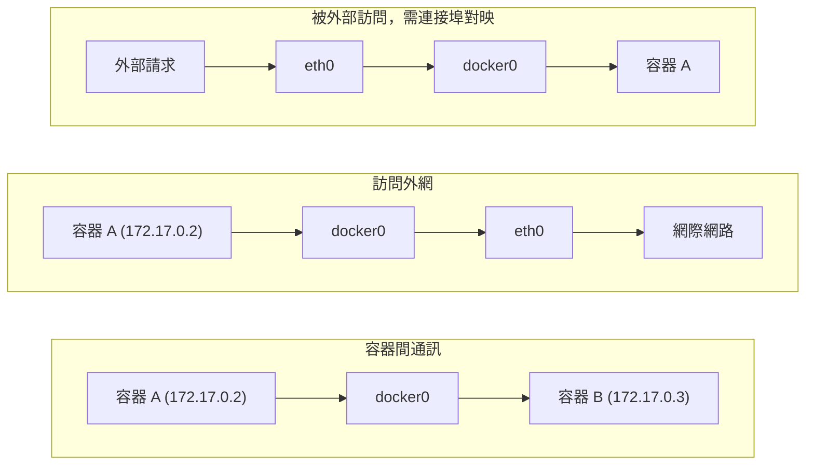

## 9.2 網路型別

Docker 提供了多種網路驅動來滿足不同的使用場景。安裝 Docker 後，系統會自動建立三個預設網路：

```bash
$ docker network ls
NETWORK ID     NAME      DRIVER    SCOPE
abc123...      bridge    bridge    local
def456...      host      host      local
ghi789...      none      null      local
```

### 9.2.1 網路型別對比

各網路型別的特點和適用場景如下：

| 網路型別 | 說明 | 適用場景 |
|---------|------|---------| 
| **bridge** | 預設類型，容器連線到虛擬網橋 | 大多數單機場景 |
| **host** | 容器直接使用宿主機網路棧 | 需要最高網路效能時 |
| **none** | 停用網路 | 完全隔離的容器 |
| **overlay** | 跨主機網路 | Docker Swarm 叢集 |
| **macvlan** | 容器擁有獨立 MAC 地址 | 需要直接接入物理網路 |

### 9.2.2 Bridge 網路 (預設)

Bridge 是 Docker 預設使用的網路模式。Docker 啟動時會自動建立 `docker0` 虛擬網橋，所有未指定網路的容器都會連線到這個網橋上。

核心元件如下：

| 元件 | 說明 |
|------|------|
| **docker0** | 虛擬網橋，充當交換機角色 |
| **veth pair** | 虛擬網絡卡對，一端在容器內，一端連線網橋 |
| **容器 eth0** | 容器內的網絡卡 |
| **IP 地址** | 自動從 172.17.0.0/16 網段分配 |

### 9.2.3 Host 網路

使用 `--network host` 引數啟動的容器會直接使用宿主機的網路棧，不再擁有獨立的網路命名空間。容器內的連接埠就是宿主機的連接埠，無需連接埠對映。

```bash
$ docker run -d --network host nginx
```

這種模式下網路效能最高，但容器之間和宿主機之間沒有網路隔離。

### 9.2.4 None 網路

使用 `--network none` 引數啟動的容器只有 `lo` 回環網絡卡，完全沒有外部網路連線。適用於只需要執行計算任務、不需要網路的容器。

```bash
$ docker run -it --network none alpine ip addr
1: lo: <LOOPBACK,UP,LOWER_UP> ...
    inet 127.0.0.1/8 scope host lo
```

### 9.2.5 資料流向

容器網路中的資料流向可以分為以下幾種情況：


