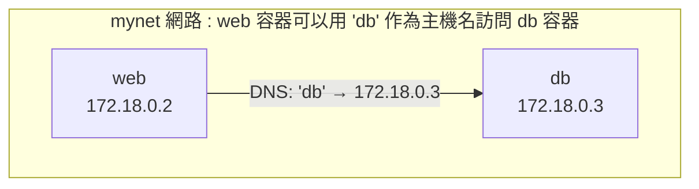

## 9.4 使用者自定義網路 (推薦)

在生產環境中，推薦使用使用者自定義網路代替預設的 bridge 網路。自定義網路提供了更好的隔離性和服務發現能力。

### 9.4.1 為什麼要用自定義網路

預設 bridge 網路存在以下侷限，而自定義網路可以很好地解決這些問題：

| 問題 | 自定義網路的優勢 |
|------|-----------------| 
| 只能用 IP 通訊 | 支援容器名 DNS 解析 |
| 所有容器在同一網路 | 更好的隔離性 |
| 需要 --link (已廢棄)| 原生支援服務發現 |

### 9.4.2 建立自定義網路

使用 `docker network create` 指令可以建立自定義網路：

```bash
## 建立網路

$ docker network create mynet

## 檢視網路詳情

$ docker network inspect mynet
```

### 9.4.3 使用自定義網路

啟動容器時透過 `--network` 引數指定連線的網路：

```bash
## 啟動容器並連線到自定義網路

$ docker run -d --name web --network mynet nginx
$ docker run -d --name db --network mynet postgres

## 在 web 容器中可以直接用容器名訪問 db

$ docker exec web ping db
PING db (172.18.0.3): 56 data bytes
64 bytes from 172.18.0.3: seq=0 ttl=64 time=0.083 ms
```

### 9.4.4 容器名 DNS 解析

自定義網路自動提供 DNS 服務。Docker 守護程序在 `127.0.0.11` 執行了一個嵌入式 DNS 伺服器，容器內的 DNS 請求會被轉發到這裡：

- 如果是容器名，解析為容器 IP
- 如果是外部網域名稱 (如 google.com)，轉發給上游 DNS



### 9.4.5 常用網路指令

以下是 Docker 網路管理中常用的指令：

```bash
## 列出網路

$ docker network ls

## 建立網路

$ docker network create mynet

## 檢視網路詳情

$ docker network inspect mynet

## 連線容器到網路

$ docker network connect mynet mycontainer

## 斷開網路連線

$ docker network disconnect mynet mycontainer

## 刪除網路

$ docker network rm mynet

## 清理未使用的網路

$ docker network prune
```
