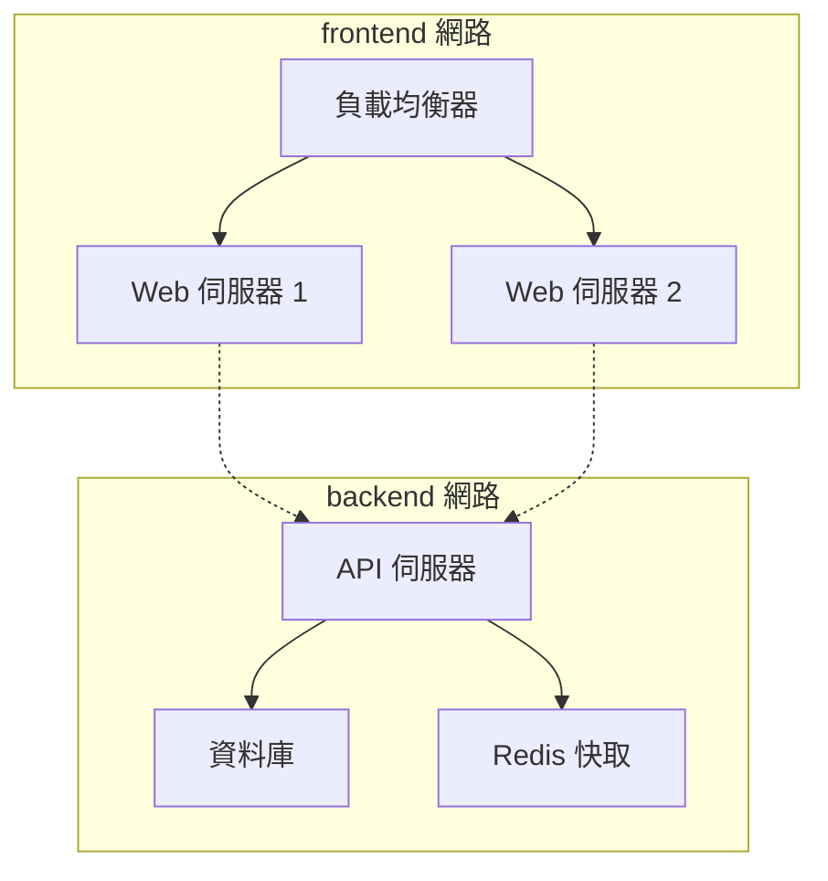

## 9.7 網路隔離

Docker 網路提供了天然的隔離能力，不同網路之間的容器預設無法通訊。這是 Docker 網路安全的重要基礎。

### 9.7.1 網路隔離原理

不同網路之間預設隔離，容器只能與同一網路中的容器直接通訊：

```bash
## 建立兩個網路

$ docker network create frontend
$ docker network create backend

## 容器 A 在 frontend

$ docker run -d --name web --network frontend nginx

## 容器 B 在 backend  

$ docker run -d --name db --network backend postgres

## web 無法直接訪問 db（不同網路）

$ docker exec web ping db
ping: db: Name or service not known
```

### 9.7.2 安全優勢

這種隔離機制帶來以下安全優勢：

| 場景 | 說明 |
|------|------|
| **前後端分離** | 前端容器無法直接訪問資料庫網路 |
| **微服務隔離** | 不同微服務組可以使用不同網路 |
| **多租戶** | 不同租戶的容器在不同網路中完全隔離 |
| **最小許可權** | 容器只能訪問必要的網路資源 |

### 9.7.3 跨網絡通訊

如果確實需要某個容器跨網絡通訊，可以將其同時連線到多個網路：

```bash
## 建立一個中間件容器，連線到兩個網路

$ docker run -d --name api --network frontend myapi
$ docker network connect backend api

## 現在 api 容器既可以訪問 frontend 中的 web，也可以訪問 backend 中的 db
```

這種方式讓你可以精確控制哪些容器可以跨網絡通訊，遵循最小許可權原則。

### 9.7.4 典型網路架構

一個典型的多層應用網路架構如下：



在這種架構中，API 伺服器同時連線到 `frontend` 和 `backend` 網路，充當兩個網路之間的橋樑。負載均衡器和 Web 伺服器無法直接訪問資料庫，增強了安全性。
