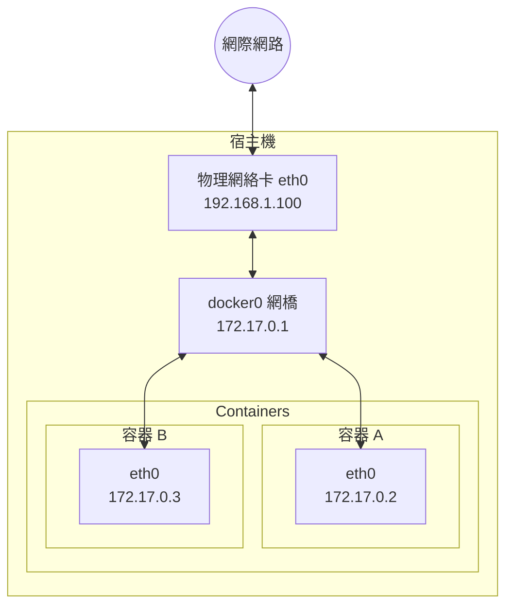

# 第九章 網路設定

Docker 容器需要網路來與外部世界通訊、容器之間相互通訊以及與宿主機通訊。Docker 在安裝時會自動設定網路基礎設施，大多數情況下開箱即用。

## 概述

Docker 啟動時自動建立以下網路元件：

本章將詳細介紹 Docker 網路設定的各個方面。

## 本章內容

* [設定 DNS](9.1_dns.md)
* [外部訪問容器](9.5_port_mapping.md)
* [網路型別](9.2_network_types.md)
* [自定義網路](9.3_custom_network.md)
* [容器互聯](9.4_container_linking.md)
* [網路隔離](9.6_network_isolation.md)
