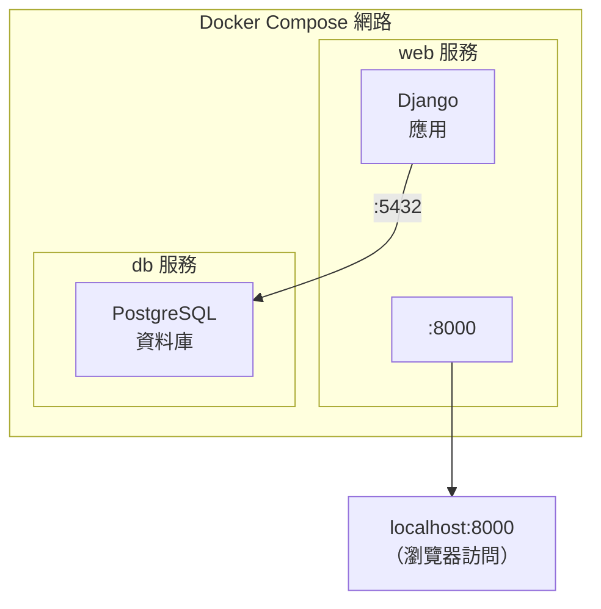

## 11.6 使用 Django

> 本小節內容適合 `Python` 開發人員閱讀。

本節將使用 Docker Compose 設定並執行一個 **Django + PostgreSQL** 應用。筆者不僅會介紹具體步驟，還會解釋每個設定項的作用，以及開發環境和生產環境的差異。

### 11.6.1 架構概覽

在開始之前，先看整體架構 (如圖 10-1 所示)：



圖 10-1 Django + PostgreSQL 的 Compose 架構

**關鍵點**：

- `web` 服務執行 Django 應用，對外暴露 8000 連接埠
- `db` 服務執行 PostgreSQL 資料庫，只在內部網路可訪問
- 兩個服務透過 Docker Compose 自動建立的網路相互通訊
- `web` 服務可以透過服務名 `db` 訪問資料庫 (Docker 內建 DNS)

### 11.6.2 準備工作

建立一個專案目錄並進入：

```bash
$ mkdir django-docker && cd django-docker
```

我們需要建立三個檔案：`Dockerfile`、`requirements.txt` 和 `compose.yaml`。

### 11.6.3 步驟 1：建立 Dockerfile

如下程式碼區塊所示，展示了相關範例：

```docker
FROM python:3.12-slim

## 防止 Python 緩衝 stdout/stderr，讓日誌實時輸出

ENV PYTHONUNBUFFERED=1

## 設定工作目錄

WORKDIR /code

## 先複製依賴檔案，利用 Docker 快取加速建立

COPY requirements.txt /code/

## 安裝依賴

RUN pip install --no-cache-dir -r requirements.txt

## 複製專案程式碼

COPY . /code/
```

**逐行解釋**：

| 指令 | 作用 | 為什麼這樣寫 |
|------|------|-------------|
| `FROM python:3.12-slim` | 基礎映象 | `slim` 版本比完整版小很多，但包含執行 Python 所需的一切 |
| `ENV PYTHONUNBUFFERED=1` | 關閉輸出緩衝 | 讓 `print()` 和日誌立即顯示，便於除錯 |
| `WORKDIR /code` | 設定工作目錄 | 後續指令都在此目錄執行 |
| `COPY requirements.txt` 在前 | 分層複製 | 只有 requirements.txt 變化時才重新安裝依賴，加速建立 |
| `--no-cache-dir` | 不快取 pip 下載 | 減小映象體積 |

> 💡 **筆者建議**：總是將變化頻率低的檔案先複製，變化頻率高的後複製。這樣可以最大化利用 Docker 的建立快取。

### 11.6.4 步驟 2：建立 requirements.txt

如下程式碼區塊所示，展示了相關範例：

```txt
Django>=5.0,<6.0
psycopg[binary]>=3.1,<4.0
gunicorn>=21.0,<22.0
```

**依賴說明**：

| 套件名 | 作用 |
|------|------|
| `Django` | Web 框架 |
| `psycopg[binary]` | PostgreSQL 資料庫驅動 (推薦使用 psycopg 3)|
| `gunicorn` | 生產環境 WSGI 伺服器 (可選，開發時可不用)|

### 11.6.5 步驟 3：建立 compose.yaml

設定如下：

```yaml
services:
  db:
    image: postgres:16
    environment:
      POSTGRES_DB: django_db
      POSTGRES_USER: django_user
      POSTGRES_PASSWORD: django_password
    volumes:
      - postgres_data:/var/lib/postgresql/data
    healthcheck:
      test: ["CMD-SHELL", "pg_isready -U django_user -d django_db"]
      interval: 5s
      timeout: 5s
      retries: 5

  web:
    build: .
    command: python manage.py runserver 0.0.0.0:8000
    volumes:
      - .:/code
    ports:
      - "8000:8000"
    depends_on:
      db:
        condition: service_healthy
    environment:
      DATABASE_URL: postgres://django_user:django_password@db:5432/django_db

volumes:
  postgres_data:
```

**設定詳解**：

#### db 服務

db 服務設定如下：

```yaml
db:
  image: postgres:16                    # 使用官方 PostgreSQL 16 映象
  environment:
    POSTGRES_DB: django_db              # 建立的資料庫名
    POSTGRES_USER: django_user          # 資料庫使用者
    POSTGRES_PASSWORD: django_password  # 資料庫密碼
  volumes:
    - postgres_data:/var/lib/postgresql/data  # 持久化資料
  healthcheck:                          # 健康檢查，確保資料庫就緒
    test: ["CMD-SHELL", "pg_isready -U django_user -d django_db"]
    interval: 5s
```

> ⚠️ **筆者提醒**：`volumes` 設定很重要！沒有它，每次容器重啟資料都會丟失。筆者見過不少新手因為忘記這一步，導致開發資料全部丟失。

#### web 服務

web 服務設定如下：

```yaml
web:
  build: .                              # 從當前目錄的 Dockerfile 建立
  command: python manage.py runserver   # 啟動 Django 開發伺服器
  volumes:
    - .:/code                           # 掛載程式碼目錄，支援熱更新
  ports:
    - "8000:8000"                       # 對映連接埠
  depends_on:
    db:
      condition: service_healthy        # 等待資料庫健康後再啟動
```

**關鍵設定說明**：

| 設定項 | 作用 | 筆者建議 |
|--------|------|---------|
| `volumes: .:/code` | 程式碼掛載 | 開發時必備，修改程式碼無需重新建立映象 |
| `depends_on` + `healthcheck` | 啟動順序 | 確保資料庫就緒後 Django 才啟動，避免連線錯誤 |
| `environment` | 環境變數 | 推薦用環境變數管理設定，避免硬編碼 |

### 11.6.6 步驟 4：建立 Django 專案

執行以下指令建立新的 Django 專案：

```bash
$ docker compose run --rm web django-admin startproject mysite .
```

**指令解釋**：

- `docker compose run`：執行一次性指令
- `--rm`：指令執行後刪除臨時容器
- `web`：在 web 服務環境中執行
- `django-admin startproject mysite .`：在當前目錄建立 Django 專案

生成的目錄結構：

```bash
django-docker/
├── compose.yaml
├── Dockerfile
├── requirements.txt
├── manage.py
└── mysite/
    ├── __init__.py
    ├── settings.py
    ├── urls.py
    ├── asgi.py
    └── wsgi.py
```

> 💡 **Linux 使用者注意**：如果遇到許可權問題，執行 `sudo chown -R $USER:$USER .`

### 11.6.7 步驟 5：設定資料庫連線

修改 `mysite/settings.py`，設定資料庫連線：

```python
import os

DATABASES = {
    'default': {
        'ENGINE': 'django.db.backends.postgresql',
        'NAME': os.environ.get('POSTGRES_DB', 'django_db'),
        'USER': os.environ.get('POSTGRES_USER', 'django_user'),
        'PASSWORD': os.environ.get('POSTGRES_PASSWORD', 'django_password'),
        'HOST': 'db',  # Docker Compose 服務名
        'PORT': 5432,
    }
}

## 允許的主機（開發環境）

ALLOWED_HOSTS = ['*']
```

**為什麼 HOST 是 `db` 而不是 `localhost`？**

在 Docker Compose 中，各服務透過服務名相互訪問。Docker 內建的 DNS 會將 `db` 解析為 db 服務容器的 IP 地址。這是 Docker Compose 的核心功能之一。

### 11.6.8 步驟 6：啟動應用

```bash
$ docker compose up
```

你會看到：

1. 首先建立 web 映象 (第一次執行)
2. 啟動 db 服務，等待健康檢查透過
3. 啟動 web 服務

```bash
db-1   | PostgreSQL init process complete; ready for start up.
db-1   | LOG:  database system is ready to accept connections
web-1  | Watching for file changes with StatReloader
web-1  | Starting development server at http://0.0.0.0:8000/
```

開啟瀏覽器訪問 http://localhost:8000，可以看到 Django 歡迎頁面！

### 11.6.9 常用開發指令

在另一個終端視窗執行：

```bash
## 執行資料庫遷移

$ docker compose exec web python manage.py migrate

## 建立超級使用者

$ docker compose exec web python manage.py createsuperuser

## 進入 Django shell

$ docker compose exec web python manage.py shell

## 進入 PostgreSQL 指令行

$ docker compose exec db psql -U django_user -d django_db
```

> 💡 筆者建議使用 `exec` 而不是 `run`。`exec` 在已執行的容器中執行指令，`run` 會建立新容器。

### 11.6.10 常見問題排查

#### Q1：資料庫連線失敗

**錯誤訊息**：`django.db.utils.OperationalError: could not connect to server` **可能原因與解決方案**：

| 原因 | 解決方案 |
|------|---------|
| 資料庫還沒啟動完成 | 使用 `depends_on` + `healthcheck` |
| HOST 設定錯誤 | 確保使用服務名 `db` 而不是 `localhost` |
| 網路未建立 | 執行 `docker compose down` 後重新 `up` |

```bash
## 除錯：檢查資料庫是否正常執行

$ docker compose ps
$ docker compose logs db
```

#### Q2：程式碼修改沒有生效

**可能原因**：

1. **開發伺服器沒有自動過載**：確保使用 `runserver` 而不是 `gunicorn`
2. **Volume 掛載問題**：檢查 `compose.yaml` 中的 volumes 設定
3. **快取問題**：嘗試 `docker compose restart web`

#### Q3：許可權問題

```bash
## 如果容器內建立的檔案 root 使用者所有

$ sudo chown -R $USER:$USER .
```

### 11.6.11 開發 vs 生產：關鍵差異

筆者特別提醒，本節的設定是 **開發環境** 設定。生產環境需要以下調整：

| 設定項 | 開發環境 | 生產環境 |
|--------|---------|---------|
| **Web 伺服器** | `runserver` | `gunicorn` + Nginx |
| **DEBUG** | `True` | `False` |
| **密碼管理** | 明文寫在設定 | 使用 Docker Secrets 或環境變數 |
| **Volume** | 掛載程式碼目錄 | 程式碼直接 COPY 進映象 |
| **ALLOWED_HOSTS**| `['*']` | 具體網域名稱 |**生產環境 Compose 檔案範例**：

```yaml
## compose.prod.yaml

services:
  web:
    build: .
    command: gunicorn mysite.wsgi:application --bind 0.0.0.0:8000
    # 不掛載程式碼，使用映象內的程式碼

    environment:
      DEBUG: 'False'
      ALLOWED_HOSTS: 'example.com,www.example.com'
    # ...

```

### 11.6.12 延伸閱讀

- [Compose 樣板檔案詳解](11.5_compose_file.md)：深入理解 Compose 檔案的所有設定項
- [使用 WordPress](11.8_wordpress.md)：另一個 Compose 實戰案例
- [Dockerfile 最佳實踐](../appendix/20.1_best_practices.md)：建立更小、更安全的映象
- [資料管理](../08_data/README.md)：Volume 和數據持久化詳解
