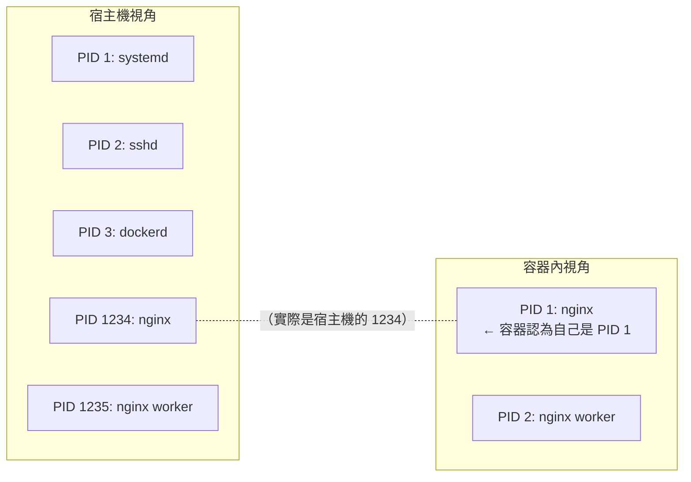
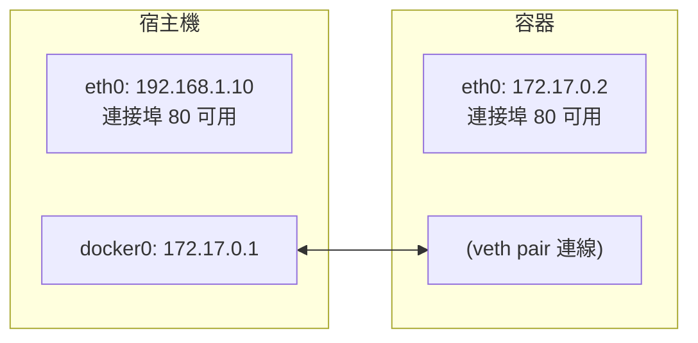
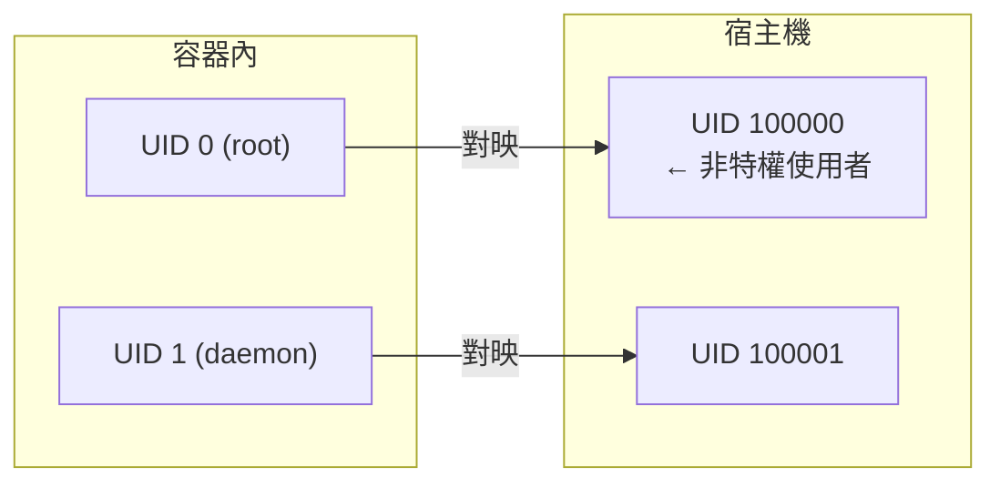

## 12.2 命名空間

命名空間是 Linux 核心一個強大的屬性。每個容器都有自己單獨的命名空間，執行在其中的應用都像是在獨立的作業系統中執行一樣。命名空間保證了容器之間彼此互不影響。

## 12.2 什麼是 Namespace

> **Namespace 是 Linux 核心提供的資源隔離機制，它讓容器內的程序髣髴執行在獨立的作業系統中。** Namespace 是容器技術的核心基礎之一。它回答了一個關鍵問題：**如何讓一個程序 『以為』 自己獨佔整個系統？**



### 12.2.1 Namespace 的型別

Linux 核心提供了以下幾種 Namespace，Docker 容器使用了全部：

| Namespace | 隔離內容 | 容器中的效果 |
|-----------|---------|-------------|
| **PID** | 程序 ID | 容器內 PID 從 1 開始，看不到其他容器和宿主機程序 |
| **NET** | 網路棧 | 獨立的網絡卡、IP 地址、連接埠、路由表 |
| **MNT** | 掛載點 | 獨立的檔案系統檢視，自己的根目錄 |
| **UTS** | 主機名 | 獨立的主機名和網域名稱 |
| **IPC** | 程序間通訊 | 獨立的訊號量、訊息佇列、共享記憶體 |
| **USER** | 使用者/組 ID | 容器內的 root 可以對映為宿主機的普通使用者 |
| **Cgroup** | Cgroup 根目錄 | 隔離 cgroup 層級檢視 (Linux 4.6+)|

---

### 12.2.2 PID Namespace

PID Namespace 負責程序 ID 的隔離，使得容器內的程序彼此不可見。

#### PID 的作用

隔離程序 ID，讓每個容器有自己的程序編號空間。

#### PID 隔離效果

```bash
## 宿主機上檢視程序

$ ps aux | grep nginx
root     12345  0.0  0.1  nginx: master process
root     12346  0.0  0.1  nginx: worker process

## 容器內檢視程序

$ docker exec mycontainer ps aux
PID   USER     COMMAND
  1   root     nginx: master process    ← 在容器內是 PID 1
  2   root     nginx: worker process
```

#### PID 關鍵點

- 容器內的 PID 1 程序特殊重要——它是容器的主程序，退出則容器停止
- 容器內無法看到宿主機或其他容器的程序
- 宿主機可以看到所有容器內的程序 (但 PID 不同)

---

### 12.2.3 NET Namespace

NET Namespace 負責網路棧的隔離，包括網絡卡、路由表和 iptables 規則等。

#### NET 的作用

隔離網路棧，每個容器擁有獨立的網路環境。

#### NET 隔離效果



#### NET 關鍵點

- 每個容器有獨立的網絡卡、IP、路由表、iptables 規則
- 多個容器可以監聽相同連接埠 (如都監聽 80)
- Docker 使用 veth pair 連線容器網路和宿主機網橋

---

### 12.2.4 MNT Namespace

MNT Namespace 負責檔案系統掛載點的隔離，確保容器看到獨立的檔案系統檢視。

#### MNT 的作用

隔離檔案系統掛載點，每個容器有自己的根目錄。

#### MNT 隔離效果

```bash
宿主機檔案系統：                  容器內看到的：
/                               /  ← 容器的根目錄
├── bin/                        ├── bin/
├── home/                       ├── home/
├── var/                        ├── var/
│   └── lib/                    │   └── lib/
│       └── docker/             │
│           └── overlay2/       │
│               └── merged/ ────┼─── 這個目錄成為容器的 /
└── ...                         └── ...
```

#### 與 chroot 的區別

| 屬性 | chroot | MNT Namespace |
|------|--------|---------------|
| 安全性 | 可以逃逸 | 更安全 |
| 掛載隔離 | 無 | 完全隔離 |
| /proc/mounts | 共享 | 獨立 |

---

### 12.2.5 UTS Namespace

UTS Namespace 主要用於隔離主機名和網域名稱。

#### UTS 的作用

隔離主機名和網域名稱，讓每個容器可以有自己的主機名。

#### UTS 隔離效果

```bash
## 宿主機

$ hostname
my-server

## 容器內

$ docker run --hostname mycontainer ubuntu hostname
mycontainer
```

UTS = 『UNIX Time-sharing System』，是歷史遺留的名稱。

---

### 12.2.6 IPC Namespace

IPC Namespace 用於隔離程序間通訊資源，如 System V IPC 和 POSIX 訊息佇列。

#### IPC 的作用

隔離 System V IPC 和 POSIX 訊息佇列。

#### 隔離的資源

- 訊號量 (semaphores)
- 訊息佇列 (message queues)
- 共享記憶體 (shared memory)

#### IPC 關鍵點

- 同一容器內的程序可以透過 IPC 通訊
- 不同容器的程序無法透過 IPC 通訊 (除非顯式共享)

---

### 12.2.7 USER Namespace

USER Namespace 允許將容器內的使用者 ID 對映到宿主機的不同使用者 ID。

#### USER 的作用

隔離使用者和組 ID，實現許可權隔離。

#### USER 隔離效果



#### 安全意義

容器內的 root 使用者可以對映為宿主機上的普通使用者，即使容器被突破，攻擊者在宿主機上也只有普通許可權。

> 💡 筆者建議：生產環境建議啟用 User Namespace，增強安全性。

---

### 12.2.8 動手實驗：體驗 Namespace

使用 `unshare` 指令可以在不使用 Docker 的情況下體驗 Namespace：

#### 實驗 1：UTS Namespace

```bash
## 建立新的 UTS namespace 並啟動 shell

$ sudo unshare --uts /bin/bash

## 修改主機名（隻影響這個 namespace）

$ hostname container-test
$ hostname
container-test

## 退出後檢視宿主機主機名（未改變）

$ exit
$ hostname
my-server
```

#### 實驗 2：PID Namespace

```bash
## 建立新的 PID 和 MNT namespace

$ sudo unshare --pid --mount --fork /bin/bash

## 掛載新的 /proc

$ mount -t proc proc /proc

## 檢視程序（只能看到當前 shell）

$ ps aux
USER       PID %CPU %MEM    VSZ   RSS TTY      STAT START   TIME COMMAND
root         1  0.0  0.0   8960  4516 pts/0    S    10:00   0:00 /bin/bash
root         8  0.0  0.0  10072  3200 pts/0    R+   10:00   0:00 ps aux
```

#### 實驗 3：NET Namespace

```bash
## 建立新的網路 namespace

$ sudo unshare --net /bin/bash

## 檢視網路介面（只有 lo）

$ ip addr
1: lo: <LOOPBACK> mtu 65536 qdisc noop state DOWN
    link/loopback 00:00:00:00:00:00 brd 00:00:00:00:00:00
```

---

### 12.2.9 Namespace 的侷限性

Namespace 提供了隔離但不是安全邊界：

| 方面 | 說明 |
|------|------|
| **共享核心** | 所有容器共享宿主機核心，核心漏洞可能影響所有容器 |
| **部分資源未隔離** | /proc、/sys 部分內容仍可見；時間無法隔離 |
| **非虛擬化** | 比虛擬機隔離性弱 |

> 需要更強隔離時，可考慮 gVisor、Kata Containers 等安全容器方案。

---
