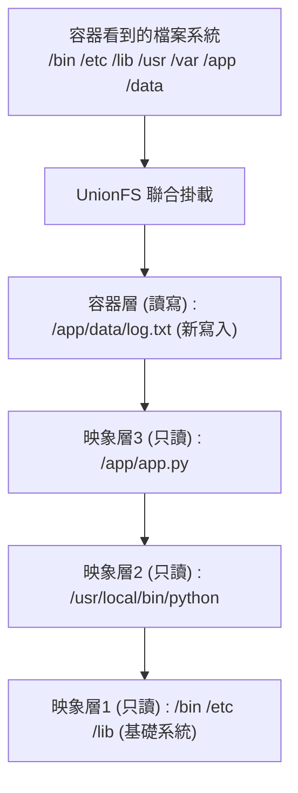
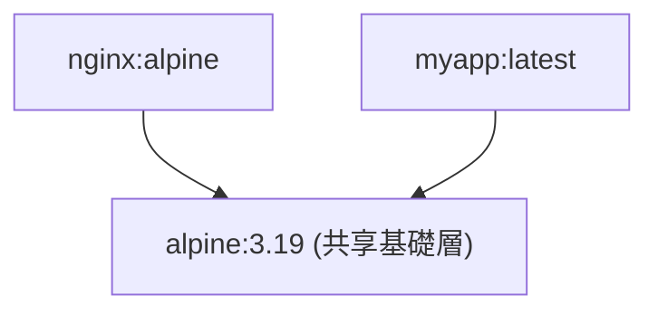
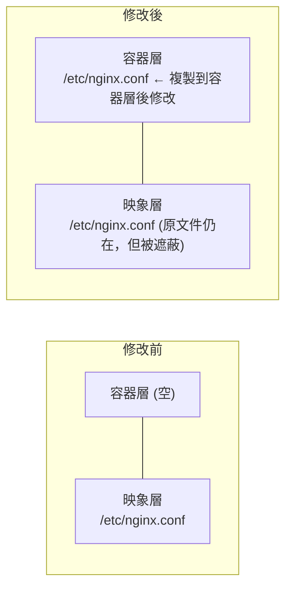
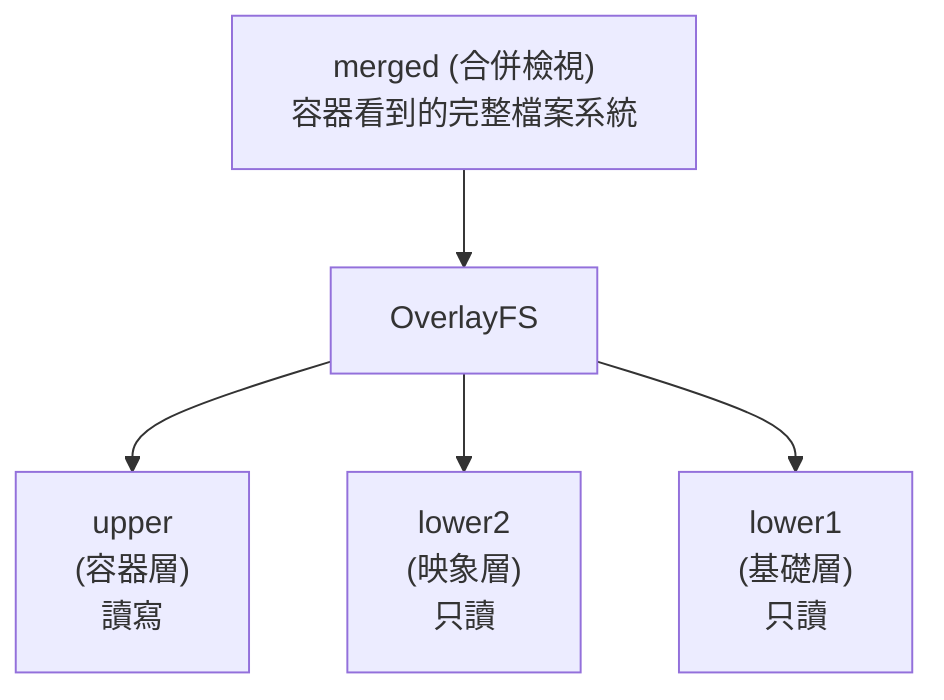

## 12.4 聯合檔案系統

聯合檔案系統 (UnionFS) 是 Docker 映象分層儲存的基礎，它允許將多個目錄掛載為同一個虛擬檔案系統。

### 12.4.1 什麼是聯合檔案系統

聯合檔案系統 (UnionFS) 是一種 **分層、輕量級** 的檔案系統，它將多個目錄 『聯合』 掛載到同一個虛擬目錄，形成一個統一的檔案系統檢視。

> **核心思想**：將多個只讀層疊加，最上層可寫，形成完整的檔案系統。



---

### 12.4.2 為什麼 Docker 使用聯合檔案系統

Docker 選擇聯合檔案系統作為其儲存驅動，主要基於以下幾個核心優勢。

#### 1. 映象分層複用

如下程式碼區塊所示，展示了相關範例：



多個映象共享相同的底層，節省磁碟空間。

#### 2. 快速建立

每個 Dockerfile 指令建立一層，只有變化的層需要重建：

```docker
FROM node:20          # 層1：基礎映象
COPY package.json ./  # 層2：依賴定義
RUN npm install       # 層3：安裝依賴
COPY . .              # 層4：應用程式碼
```

程式碼變化時，只需重建層 4，層 1-3 使用快取。

#### 3. 容器啟動快

容器啟動時不需要複製映象，只需：

1. 在映象層上建立一個薄的可寫層
2. 聯合掛載所有層

---

### 12.4.3 Copy-on-Write (寫時複製)

當容器修改只讀層中的檔案時：



**流程**：

1. 從只讀層讀取檔案
2. 複製到容器的可寫層
3. 在可寫層中修改
4. 後續讀取使用可寫層的版本

---

### 12.4.4 Docker 支援的儲存驅動

Docker 可使用多種聯合檔案系統實現：

| 儲存驅動 | 說明 | 推薦程度 |
|---------|------|---------|
| **overlay2**| 現代 Linux 預設驅動，效能優秀 | ✅**推薦** |
| **aufs** | 早期預設，相容性好 | 遺留系統 |
| **btrfs** | 使用 Btrfs 子卷 | 特定場景 |
| **zfs** | 使用 ZFS 資料集 | 特定場景 |
| **devicemapper** | 區塊裝置級儲存 | 遺留系統 |
| **vfs** | 不使用 CoW，每層完整複製 | 僅測試 |

#### 各發行版推薦

| Linux 發行版 | 推薦儲存驅動 |
|-------------|-------------|
| Ubuntu 16.04+ | overlay2 |
| Debian Stretch+ | overlay2 |
| CentOS 7+ | overlay2 |
| RHEL 8+ | overlay2 |
| Fedora | overlay2 |

#### 檢視當前儲存驅動

```bash
$ docker info | grep "Storage Driver"
Storage Driver: overlay2
```

---

### 12.4.5 overlay2 工作原理

overlay2 是目前最推薦的儲存驅動：



- **lowerdir**：只讀的映象層 (可以有多個)
- **upperdir**：可寫的容器層
- **workdir**：OverlayFS 的工作目錄
- **merged**：聯合掛載後的檢視

#### 檔案操作行為

| 操作 | 行為 |
|------|------|
| **讀取** | 從上到下查詢第一個對應的檔案 |
| **建立** | 在 upper 層建立 |
| **修改** | 如果在 lower 層，先複製到 upper 層再修改 |
| **刪除** | 在 upper 層建立 whiteout 檔案標記刪除 |

---

### 12.4.6 檢視映象層

```bash
## 檢視映象的層訊息

$ docker history nginx:alpine
IMAGE          CREATED       CREATED BY                                      SIZE
a6eb2a334a9f   2 weeks ago   CMD ["nginx" "-g" "daemon off;"]                0B
<missing>      2 weeks ago   STOPSIGNAL SIGQUIT                              0B
<missing>      2 weeks ago   EXPOSE map[80/tcp:{}]                           0B
<missing>      2 weeks ago   ENTRYPOINT ["/docker-entrypoint.sh"]            0B
<missing>      2 weeks ago   COPY 30-tune-worker-processes.sh /docker-ent…   4.62kB
...

## 檢視層的儲存位置

$ docker inspect nginx:alpine --format '{{json .GraphDriver.Data}}' | jq
{
  "LowerDir": "/var/lib/docker/overlay2/.../diff:/var/lib/docker/overlay2/.../diff",
  "MergedDir": "/var/lib/docker/overlay2/.../merged",
  "UpperDir": "/var/lib/docker/overlay2/.../diff",
  "WorkDir": "/var/lib/docker/overlay2/.../work"
}
```

---

### 12.4.7 最佳實踐

為了建立高效、輕量的映象，我們在使用聯合檔案系統時應注意以下幾點。

#### 1. 減少映象層數

如下程式碼區塊所示，展示了相關範例：

```docker
## ❌ 每條指令建立一層

RUN apt-get update
RUN apt-get install -y nginx
RUN rm -rf /var/lib/apt/lists/*

## ✅ 合併為一層

RUN apt-get update && \
    apt-get install -y nginx && \
    rm -rf /var/lib/apt/lists/*
```

#### 2. 避免在容器中寫入大量資料

容器層的寫入效能低於直接寫入。大量資料應使用：

- 資料卷 (Volume)
- 繫結掛載 (Bind Mount)

#### 3. 使用 .dockerignore

排除不需要的檔案可以：

- 減小建立上下文
- 避免建立不必要的層

---
