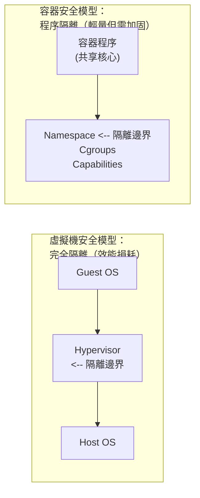

# 第十八章 安全

容器安全是生產環境部署的核心考量。本章介紹 Docker 的安全機制和最佳實踐。

## 容器安全的本質

> **核心問題**：容器共享宿主機核心，隔離性弱於虛擬機。如何在便利性和安全性之間取得平衡？



---

## 核心安全機制

### 1. 命名空間

提供程序、網路、檔案系統等資源的隔離：

| Namespace | 隔離內容 | 安全作用 |
|-----------|---------|---------|
| PID | 程序 | 容器看不到其他程序 |
| NET | 網路 | 獨立網路棧 |
| MNT | 檔案系統 | 獨立的根目錄 |
| USER | 使用者 | 容器 root ≠ 宿主機 root |
| IPC | 程序通訊 | 隔離共享記憶體 |
| UTS | 主機名 | 獨立主機名 |

詳見[命名空間](../12_implementation/12.2_namespace.md)章節。

### 2. 控制組

限制容器的資源使用，防止資源耗盡攻擊：

```bash
## 限制記憶體（超出會被 OOM Kill）

$ docker run -m 512m myapp

## 限制 CPU

$ docker run --cpus=1.5 myapp

## 限制磁碟 I/O

$ docker run --device-write-bps /dev/sda:10mb myapp
```

### 3. 能力機制

Linux 將 root 許可權拆分為多個細粒度的能力。Docker 預設停用危險能力：

| 能力 | 說明 | 預設狀態 |
|------|------|---------|
| `CAP_NET_ADMIN` | 網路管理 | ❌ 停用 |
| `CAP_SYS_ADMIN` | 系統管理 | ❌ 停用 |
| `CAP_SYS_PTRACE` | 程序追蹤 | ❌ 停用 |
| `CAP_CHOWN` | 更改檔案所有者 | ✅ 啟用 |
| `CAP_NET_BIND_SERVICE` | 繫結低端口 | ✅ 啟用 |

```bash
## 刪除所有能力，只新增需要的

$ docker run --cap-drop=all --cap-add=NET_BIND_SERVICE myapp

## 檢視容器的能力

$ docker exec myapp cat /proc/1/status | grep Cap
```

---

## 映象安全

### 使用可信映象

```bash
## ✅ 使用官方映象

$ docker pull nginx

## ✅ 使用經過驗證的映象

$ docker pull bitnami/nginx

## ⚠️ 謹慎使用未知來源映象

$ docker pull randomuser/suspicious-image
```

### 漏洞掃描

掃描映象中的已知安全漏洞：

```bash
## Docker Scout（官方工具）

$ docker scout cves nginx:latest
$ docker scout recommendations nginx:latest

## Trivy（開源工具）

$ trivy image nginx:latest

## Snyk（商業工具）

$ snyk container test nginx:latest
```

### 映象簽名驗證

當前更推薦使用 Sigstore / Notation 體系進行映象簽名。`Docker Content Trust (DCT)` 已進入退場階段，不建議作為新專案主方案。

> 注意：Cosign 預設會把簽名寫回映象所在倉庫，請使用你有推送許可權的映象地址。

```bash
## 準備範例映象
$ export IMAGE=<你的倉庫地址>/myimage:latest
$ docker pull nginx:1.27
$ docker tag nginx:1.27 $IMAGE
$ docker push $IMAGE

## 生成簽名金鑰（會生成 cosign.key / cosign.pub）
$ cosign generate-key-pair

## Cosign: 簽名與驗證
$ cosign sign --key cosign.key $IMAGE
$ cosign verify --key cosign.pub $IMAGE
```

---

## 執行時安全

### 1. 非 root 使用者執行

> 筆者強調：這是最重要的安全實踐之一。

```dockerfile
FROM node:22-alpine

## 建立非 root 使用者

RUN addgroup -g 1001 appgroup && \
    adduser -u 1001 -G appgroup -D appuser

## 設定工作目錄許可權

WORKDIR /app
COPY --chown=appuser:appgroup . .

## 切換使用者

USER appuser

CMD ["node", "server.js"]
```

或在執行時指定：

```bash
$ docker run -u 1001:1001 myapp
```

### 2. 只讀檔案系統

```bash
## 根檔案系統只讀

$ docker run --read-only myapp

## 需要寫入的目錄使用 tmpfs

$ docker run --read-only --tmpfs /tmp --tmpfs /var/run myapp
```

### 3. 停用特權模式

```bash
## ❌ 絕對不要在生產環境使用

$ docker run --privileged myapp

## ✅ 只新增必要的能力

$ docker run --cap-add=SYS_TIME myapp
```

### 4. 限制資源

```bash
$ docker run \
    -m 512m \                    # 記憶體限制
    --cpus=1 \                   # CPU 限制
    --pids-limit=100 \           # 程序數限制
    --ulimit nofile=1024:1024 \  # 檔案描述符限制
    myapp
```

### 5. 網路隔離

```bash
## 停用網路（適用於不需要網路的任務）

$ docker run --network=none myapp

## 使用自定義網路隔離

$ docker network create --internal isolated_net
$ docker run --network=isolated_net myapp
```

---

## Dockerfile 安全實踐

### 1. 使用精簡基礎映象

```dockerfile
## ✅ 好：使用精簡映象

FROM node:22-alpine        # ~50MB
FROM gcr.io/distroless/nodejs  # ~20MB

## ❌ 差：使用完整映象

FROM node:22               # ~1GB
FROM ubuntu:24.04          # ~78MB
```

### 2. 多階段建立

```dockerfile
## 建立階段

FROM node:22 AS builder
WORKDIR /app
COPY . .
RUN npm install && npm run build

## 生產階段（不包含開發依賴和原始碼）

FROM node:22-alpine
COPY --from=builder /app/dist /app
USER node
CMD ["node", "/app/server.js"]
```

### 3. 不儲存敏感訊息

```dockerfile
## ❌ 錯誤：敏感訊息寫入映象

ENV DB_PASSWORD=secret123
COPY .env /app/

## ✅ 正確：執行時傳入

## docker run -e DB_PASSWORD=xxx 或使用 Docker Secrets

...
```

### 4. 固定依賴版本

```dockerfile
## ✅ 固定版本

FROM node:22.12.0-alpine3.21
RUN apk add --no-cache curl=8.5.0-r0

## ❌ 使用 latest

FROM node:latest
RUN apk add curl
```

---

## 安全掃描清單

部署前檢查：

| 檢查項 | 指令/方法 |
|--------|----------|
| 漏洞掃描 | `docker scout cves` 或 `trivy` |
| 非 root 執行 | 檢查 Dockerfile 中的 `USER` |
| 資源限制 | 檢查 `-m`, `--cpus` 引數 |
| 只讀檔案系統 | 檢查 `--read-only` |
| 無特權模式 | 確認沒有 `--privileged` |
| 最小能力 | 檢查 `--cap-drop=all` |
| 網路隔離 | 檢查網路設定 |
| 敏感訊息 | 確認無硬編碼密碼 |

---

## 高階安全方案

### Seccomp 系統呼叫過濾

限制容器可以使用的系統呼叫：

```bash
$ docker run --security-opt seccomp=/path/to/profile.json myapp
```

### AppArmor / SELinux

使用強制訪問控制：

```bash
$ docker run --security-opt apparmor=docker-default myapp
```

### 安全容器 (gVisor / Kata)

需要更強隔離時：

```bash
## 使用 gVisor 執行時

$ docker run --runtime=runsc myapp
```

---

## 軟體供應鏈安全

隨著軟體供應鏈攻擊日益頻繁，僅保障執行時安全已不足夠。

### 1. SBOM (軟體物料清單)

SBOM 類似於食品的配料表，列出了容器映象中包含的所有軟體套件及其版本。

- **生成 SBOM**：使用 `docker buildx build --sbom` 或 `docker scout sbom`。
- **管理 SBOM**：確保持續監控 SBOM 中的元件是否存在新披露的漏洞。

### 2. 映象簽名 (Sigstore / Notary v2)

確保映象在建立後未被篡改，且確實來自可信的發布者。

- **Cosign**：Sigstore 專案的一部分，用於簽署和驗證容器映象。
```bash
## 使用有寫許可權的倉庫地址
$ export IMAGE=<你的倉庫地址>/myimage:tag
$ docker pull nginx:1.27
$ docker tag nginx:1.27 $IMAGE
$ docker push $IMAGE

## 生成簽名金鑰（會生成 cosign.key / cosign.pub）
$ cosign generate-key-pair

## 簽署與驗證映象
$ cosign sign --key cosign.key $IMAGE
$ cosign verify --key cosign.pub $IMAGE
```

### 3. SLSA (Supply-chain Levels for Software Artifacts)

遵循 SLSA 框架，確保建立過程的完整性，例如使用 GitHub Actions 等受控環境進行建立，而非在開發者本地機器上建立發布。

---

## 本章小結

| 安全措施 | 重要程度 | 實現方式 |
|---------|---------|---------|
| 非 root 執行 | ⭐⭐⭐ | `USER` 指令 |
| 漏洞掃描 | ⭐⭐⭐ | `docker scout`, `trivy` |
| 資源限制 | ⭐⭐⭐ | `-m`, `--cpus` |
| 只讀檔案系統 | ⭐⭐ | `--read-only` |
| 最小能力 | ⭐⭐ | `--cap-drop=all` |
| 映象簽名 | ⭐⭐ | `cosign` / Notation |

## 延伸閱讀

- [命名空間](../12_implementation/12.2_namespace.md)：隔離機制詳解
- [控制組](../12_implementation/12.3_cgroups.md)：資源限制詳解
- [最佳實踐](../appendix/best_practices.md)：Dockerfile 安全設定
