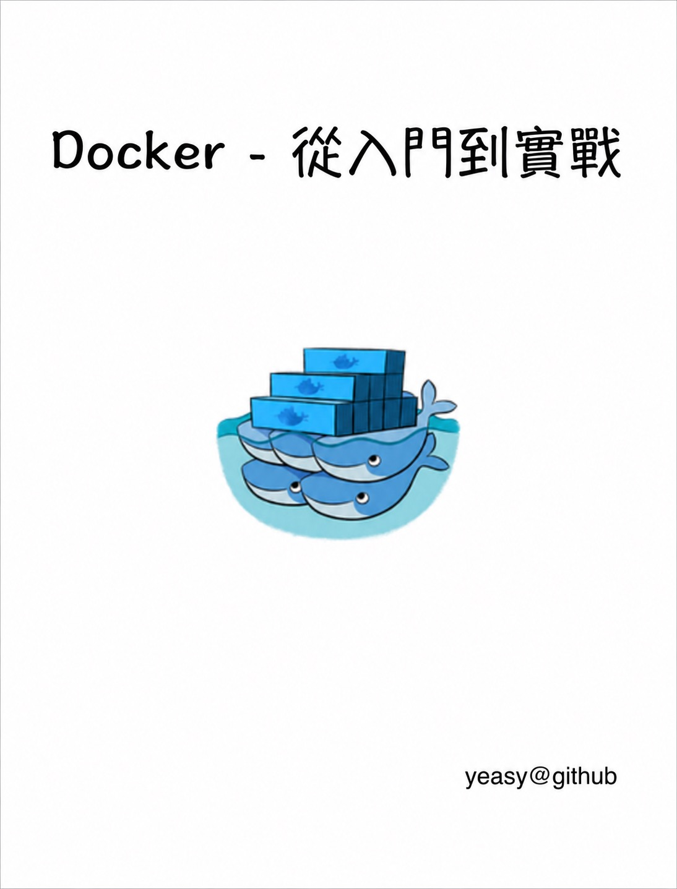
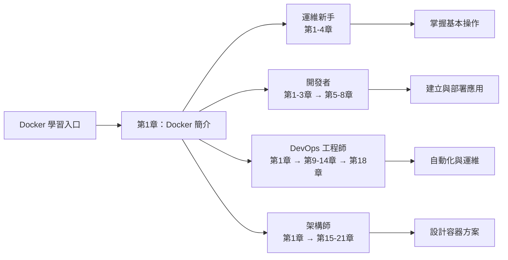

<div align="center">

# Docker 從入門到實踐

[](https://creativecommons.org/licenses/by-nc-sa/4.0/)
[](https://github.com/yeasy/docker_practice)
[](https://github.com/yeasy/docker_practice/releases)
[](https://yeasy.gitbook.io/docker_practice)
[](https://github.com/yeasy/docker_practice/releases/latest)
[](https://docs.docker.com/engine/release-notes/)

> 從零開始，系統掌握 Docker 容器技術的核心概念、原理與實戰技巧



</div>

---

## 關於本書

[Docker](https://www.docker.com) 是個劃時代的開源專案，它徹底釋放了計算虛擬化的威力，極大提高了應用的維護效率，降低了雲端運算應用開發的成本！使用 Docker，可以讓應用的部署、測試和分發都變得前所未有的高效和輕鬆！

無論是應用開發者、運維人員、還是其他資訊科技從業人員，都有必要認識和掌握 Docker，節約有限的生命。

本書既適用於具備基礎 Linux 知識的 Docker 初學者，也希望可供理解原理和實現的高階使用者參考。同時，書中給出的實踐案例，可供在進行實際部署時借鑑。

## 內容特色

*   **入門基礎**：第 1 ~ 6 章為基礎內容，幫助深入理解 Docker 的基本概念 (映象、容器、倉庫) 和核心操作。
*   **進階應用**：第 7 ~ 11 章涵蓋 Dockerfile 指令詳解、資料與網路管理、Buildx、Compose 等高階設定和管理操作。
*   **深入原理**：第 12 ~ 17 章介紹其底層實現技術，深入探討容器編排體系 (Kubernetes、Etcd)，並延伸涉及容器與雲端運算及其它關鍵生態專案 (Fedora CoreOS、Podman 等)。
*   **實戰擴充套件**：第 18 ~ 21 章重點討論容器安全防護機制、監控與日誌聚合系統 (Prometheus、ELK)，並展示作業系統、CI/CD 自動化建立等典型實踐案例。

## 五分鐘快速上手

『5分鐘執行第一個容器』——跟隨以下步驟快速體驗 Docker：

1. **安裝 Docker**（第3章）：根據作業系統完成 Docker 的安裝與驗證
2. **第一個容器**（第1章 `1.1`）：快速體驗建立映象與啟動容器的完整流程
3. **互動式容器**（第5章）：執行 `docker run -it ubuntu bash`，進入容器內部與系統互動
4. **映象與倉庫**（第2章、第4章、第6章）：理解核心概念，並學會拉取、使用與管理映象和倉庫
5. **自定義映象**（第7章）：學習如何編寫 Dockerfile 建立自己的映象

## 學習路線圖


| 讀者角色 | 學習重點 | 核心成果 |
|---------|---------|---------|
| **運維新手** | 第1-4章 | 掌握容器的基本概念與操作 |
| **開發者** | 第1-3章 → 第5-8章 | 學會容器化應用的建立與部署 |
| **DevOps 工程師** | 第1章 → 第9-14章 → 第18章 | 實現容器編排與自動化部署流程 |
| **架構師** | 第1章 → 第15-21章 | 設計高可用、高效能的容器基礎設施 |

## 線上閱讀

本書線上閱讀，可直接訪問 [GitBook](https://yeasy.gitbook.io/docker_practice/)。也可訪問 [GitHub 倉庫目錄](https://github.com/yeasy/docker_practice/blob/master/SUMMARY.md) 或 [映象站點](https://vuepress.mirror.docker-practice.com/)。

## 下載離線版本

本書提供 PDF 版本供離線閱讀，可前往 [GitHub Releases](https://github.com/yeasy/docker_practice/releases/latest) 頁面下載最新版本。

如需獲取預設分支自動更新的預覽版，可直接下載 [docker_practice.pdf](https://github.com/yeasy/docker_practice/releases/download/preview-pdf/docker_practice.pdf)。該檔案會隨主線更新覆蓋，不代表正式發布版本。

## 本地閱讀

先安裝 [mdPress](https://github.com/yeasy/mdpress)：

```bash
brew tap yeasy/tap && brew install mdpress
mdpress serve
```

或使用 Docker 映象一條指令啟動：

```bash
docker run -it --rm -p 4000:80 ccr.ccs.tencentyun.com/dockerpracticesig/docker_practice:vuepress
```

## 社群交流

- [GitHub Discussions](https://github.com/yeasy/docker_practice/discussions)（技術問答、交流）
- [GitHub Issues](https://github.com/yeasy/docker_practice/issues/new/choose)（內容錯誤、建議）

## 推薦閱讀

本書是技術叢書的一部分。以下書籍與本書形成互補：

| 書名 | 與本書的關係 |
|------|------------|
| [《智慧體 Harness 工程指南》](https://yeasy.gitbook.io/harness_engineering_guide) | Agent 基礎設施中的容器化部署與隔離 |
| [《大模型安全權威指南》](https://yeasy.gitbook.io/ai_security_guide) | 容器安全與 AI 系統安全的交叉實踐 |
| [《區塊鏈技術指南》](https://yeasy.gitbook.io/blockchain_guide) | 區塊鏈節點的容器化部署 |

## 參與貢獻

歡迎[參與專案維護](CONTRIBUTING.md)。

*   [修訂記錄](CHANGELOG.md)
*   [貢獻者名單](https://github.com/yeasy/docker_practice/graphs/contributors)

## 進階學習

《[Docker 技術入門與實戰][1]》已更新到第 4 版，講解最新容器技術棧知識，歡迎大家閱讀並反饋建議。[京東圖書][1] | [天貓圖書](https://detail.tmall.com/item.htm?id=997383773726&skuId=6143496614475)

## 支援鼓勵

歡迎鼓勵專案一杯 coffee~

<p align="center">

</p>

## Star History

<p align="center">
  <a href="https://star-history.com/#yeasy/docker_practice&Date">
    
  </a>
</p>

## 許可證

本書採用 [CC BY-NC-SA 4.0](https://creativecommons.org/licenses/by-nc-sa/4.0/) 許可證。

您可以自由分享和演繹，但需署名、非商業使用、相同方式共享。

[1]: https://item.jd.com/10200902362001.html
